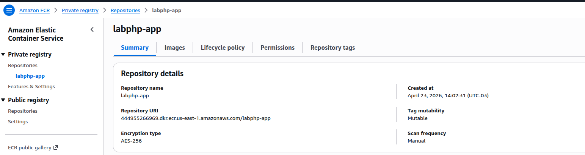

# Lab AWS + EC2 Ubuntu 24.04 + Docker + ECR + RDS + S3 + Nginx + PHP

Este laboratório sobe uma aplicação PHP simples de e-commerce em uma instância **EC2 Ubuntu 24.04**, usando:

- **Docker Engine + Docker Compose plugin**
- **Dockerfile multi-stage**
- **AWS ECR** para armazenar a imagem da aplicação
- **Docker Compose** para subir `app` + `nginx`
- **AWS RDS MySQL** como banco externo
- **Amazon S3** para armazenar as imagens dos produtos
- **AWS Systems Manager Parameter Store** para injetar variáveis de ambiente
- **Cloudflare DNS** para publicar o domínio `labphp.skynalytix.com.br`

> A aplicação contém:
> - Home com 3 produtos
> - Página de detalhe do produto
> - Cadastro de cliente
> - Login do cliente
> - Sem checkout e sem carrinho

---

## 1) Arquitetura do lab

```text
Usuário
  |
  v
Cloudflare DNS/Proxy
  |
  v
EC2 Ubuntu 24.04
  |
  +--> container nginx (porta 80)
  |       |
  |       v
  |    container app (PHP-FPM)
  |
  +--> AWS RDS MySQL (cadastro/login/produtos)
  |
  +--> Amazon S3 (imagens dos produtos)
  |
  +--> AWS ECR (imagem da aplicação)
  |
  +--> AWS SSM Parameter Store (variáveis)
```

---

## 2) Recursos AWS que você vamos

### Rede e segurança
- 1 VPC (pode usar a default para simplificar a aula)
- 1 Security Group da EC2
- 1 Security Group do RDS

### Compute
- 1 EC2 Ubuntu 24.04

### Banco
- 1 RDS MySQL

### Container registry
- 1 repositório ECR privado: `labphp-app`

### Storage
- 1 bucket S3 para mídias: ex. `labphpmedia`

### Configuração
- parâmetros no SSM Parameter Store, por exemplo:
  - `/labphp/prod/APP_IMAGE`
  - `/labphp/prod/APP_NAME`
  - `/labphp/prod/APP_URL`
  - `/labphp/prod/APP_SESSION_NAME`
  - `/labphp/prod/DB_HOST`
  - `/labphp/prod/DB_PORT`
  - `/labphp/prod/DB_NAME`
  - `/labphp/prod/DB_USER`
  - `/labphp/prod/DB_PASSWORD`

---

## 4) Estrutura do projeto

```text
lab-aws-ec2-docker/
├── app/
│   ├── composer.json
│   ├── public/
│   │   └── index.php
│   └── src/
│       ├── bootstrap.php
│       └── Database.php
├── compose.yaml
├── db/
│   └── schema.sql
├── docker/
│   └── php/
│       ├── Dockerfile
│       └── php.ini
├── nginx/
│   └── default.conf
├── scripts/
│   └── render-env-from-ssm.sh
└── .env.runtime.example
```

---

## 5) Pré-requisitos

### Na sua conta AWS
- EC2
- RDS
- ECR
- S3
- SSM Parameter Store
- IAM Role para a EC2

### Na EC2
- Docker Engine
- Docker Compose plugin
- AWS CLI

---

## 6) Criando a EC2 Ubuntu 24.04

Sugestão para aula:

- **AMI**: Ubuntu Server 24.04 LTS
- **Tipo**: `t3.small`
- **Disco**: 30 GB gp3
- **Security Group EC2**:
  - 22/TCP: Allow Anywhere
  - 80/TCP: Allow http
  - 443/TCP: Allow https

### IAM Role da EC2
Anexe a role do arquivo json: ec2-instance-role-policy.json que permite:

- pull/push no ECR
- leitura no SSM Parameter Store
- acesso ao S3 para upload das mídias

---

## 7) Instalando Docker e AWS CLI na EC2

### Docker

```bash
sudo apt-get update
sudo apt-get install -y ca-certificates curl gnupg

sudo install -m 0755 -d /etc/apt/keyrings
curl -fsSL https://download.docker.com/linux/ubuntu/gpg | sudo gpg --dearmor -o /etc/apt/keyrings/docker.gpg
sudo chmod a+r /etc/apt/keyrings/docker.gpg

echo \
  "deb [arch=$(dpkg --print-architecture) signed-by=/etc/apt/keyrings/docker.gpg] https://download.docker.com/linux/ubuntu \
  $(. /etc/os-release && echo "$VERSION_CODENAME") stable" | \
  sudo tee /etc/apt/sources.list.d/docker.list > /dev/null

sudo apt-get update
sudo apt-get install -y docker-ce docker-ce-cli containerd.io docker-buildx-plugin docker-compose-plugin

sudo systemctl enable docker
sudo systemctl start docker
sudo systemctl status docker
sudo usermod -aG docker ubuntu
newgrp docker

docker --version
docker compose version
```

### AWS CLI

```bash
sudo apt-get update
sudo apt-get install -y unzip curl

curl "https://awscli.amazonaws.com/awscli-exe-linux-x86_64.zip" -o "awscliv2.zip"
unzip awscliv2.zip
sudo ./aws/install

aws --version
```

---

## 8) Criando o ECR

Escolha uma região, por exemplo `us-east-1`.

```bash
export AWS_REGION=us-east-1
export AWS_ACCOUNT_ID=$(aws sts get-caller-identity --query Account --output text)
export ECR_REPO=labphp-app

aws ecr create-repository \
  --region "$AWS_REGION" \
  --repository-name "$ECR_REPO"
```

URI esperada:

```bash
${AWS_ACCOUNT_ID}.dkr.ecr.${AWS_REGION}.amazonaws.com/labphp-app
```



## 8) Clone repo

git clone 


---

## 9) Build da imagem da aplicação (multi-stage)

Na raiz do projeto:

```bash
docker build -f docker/php/Dockerfile -t labphp-app:1.0.0 .
```

### Tag para o ECR

```bash
export APP_IMAGE=${AWS_ACCOUNT_ID}.dkr.ecr.${AWS_REGION}.amazonaws.com/labphp-app:1.0.0
docker tag labphp-app:1.0.0 "$APP_IMAGE"
```

### Login no ECR

```bash
aws ecr get-login-password --region "$AWS_REGION" \
  | docker login --username AWS --password-stdin ${AWS_ACCOUNT_ID}.dkr.ecr.${AWS_REGION}.amazonaws.com
```

### Push

```bash
docker push "$APP_IMAGE"
```

---

## 10) Criando o RDS MySQL

### Sugestão didática
- Engine: MySQL 8.0
- Classe: `db.t3.micro` ou `db.t4g.micro`
- Public access: **No**
- Mesmo VPC da EC2
- Porta: 3306

### Security Groups

#### SG da EC2
- saída liberada

#### SG do RDS
- entrada `3306/TCP` **somente a partir do SG da EC2**

Isso é muito melhor do que liberar o banco para internet.

### Banco e usuário
Exemplo:
- DB name: `labphp`
- Username: `labphp_user`
- Password: sua senha segura

---

## 11) Criando o schema no RDS

Use o endpoint do RDS e rode o arquivo `db/schema.sql`.

### Via cliente mysql na EC2

```bash
sudo apt-get install -y mysql-client

mysql -h SEU_RDS_ENDPOINT -P 3306 -u labphp_user -p < db/schema.sql
```

> Depois substitua no arquivo `db/schema.sql` o bucket/região corretos nas URLs das imagens.

---

## 12) Criando bucket S3 para as imagens dos produtos

### Criar bucket

```bash
export BUCKET_NAME=labphpmedia
aws s3 mb s3://$BUCKET_NAME --region $AWS_REGION
```

### Estrutura sugerida

```text
s3://$BUCKET_NAME/products/
├── fone-bluetooth-pro.jpg
├── smartwatch-fit-one.jpg
└── mochila-urban-tech.jpg
```

### Upload

```bash
aws s3 cp ./media/fone-bluetooth-pro.jpg s3://$BUCKET_NAME/products/
aws s3 cp ./media/smartwatch-fit-one.jpg s3://$BUCKET_NAME/products/
aws s3 cp ./media/mochila-urban-tech.jpg s3://$BUCKET_NAME/products/
```

### Atualize as URLs no banco

Padrão:

```text
https://SEU_BUCKET.s3.REGIAO.amazonaws.com/products/arquivo.jpg
```

> Para simplificar a aula, você pode deixar essas 3 imagens públicas apenas para leitura.
> Em ambiente real, o ideal seria usar S3 privado + CloudFront.

---

## 13) Gravando variáveis no SSM Parameter Store

### Exemplo

```bash
aws ssm put-parameter --region $AWS_REGION --name /labphp/prod/APP_IMAGE --type String --value "$APP_IMAGE" --overwrite
aws ssm put-parameter --region $AWS_REGION --name /labphp/prod/APP_NAME --type String --value "SkyNalytix Lab PHP" --overwrite
aws ssm put-parameter --region $AWS_REGION --name /labphp/prod/APP_URL --type String --value "https://labphp.skynalytix.com.br" --overwrite
aws ssm put-parameter --region $AWS_REGION --name /labphp/prod/APP_SESSION_NAME --type String --value "LABPHPSESSID" --overwrite
aws ssm put-parameter --region $AWS_REGION --name /labphp/prod/DB_HOST --type String --value "SEU_RDS_ENDPOINT" --overwrite
aws ssm put-parameter --region $AWS_REGION --name /labphp/prod/DB_PORT --type String --value "3306" --overwrite
aws ssm put-parameter --region $AWS_REGION --name /labphp/prod/DB_NAME --type String --value "labphp" --overwrite
aws ssm put-parameter --region $AWS_REGION --name /labphp/prod/DB_USER --type String --value "labphp_user" --overwrite
aws ssm put-parameter --region $AWS_REGION --name /labphp/prod/DB_PASSWORD --type SecureString --value "SUA_SENHA_AQUI" --overwrite
```

---

## 14) Gerando o `.env.runtime` a partir do SSM

O script `scripts/render-env-from-ssm.sh` busca os parâmetros e gera o arquivo local usado pelo Compose.

```bash
chmod +x scripts/render-env-from-ssm.sh
export AWS_REGION=us-east-1
./scripts/render-env-from-ssm.sh .env.runtime /labphp/prod
```

Exemplo de saída esperada:

```bash
APP_IMAGE=123456789012.dkr.ecr.us-east-1.amazonaws.com/labphp-app:1.0.0
APP_NAME=SkyNalytix Lab PHP
APP_URL=https://labphp.skynalytix.com.br
APP_SESSION_NAME=LABPHPSESSID
DB_HOST=labphp-mysql.xxxxxx.us-east-1.rds.amazonaws.com
DB_PORT=3306
DB_NAME=labphp
DB_USER=labphp_user
DB_PASSWORD=******
```

---

## 15) Subindo a aplicação com Docker Compose

```bash
docker compose pull
docker compose up -d
```

### Verificações

```bash
docker compose ps
docker logs labphp-app
docker logs labphp-nginx
curl -I http://127.0.0.1/healthz
curl -I http://127.0.0.1/
```

---

## 16) Publicando no domínio `labphp.skynalytix.com.br`

No Cloudflare:

- crie um registro **A** apontando para o IP público da EC2
- nome: `labphp`
- valor: `IP_PUBLICO_DA_EC2`

Depois teste:

```bash
curl -I http://labphp.skynalytix.com.br
```

---

## 17) Fluxo recomendado para sua aula

### Parte 1 — Infra AWS
1. Criar EC2
2. Criar RDS
3. Ajustar Security Groups
4. Criar bucket S3
5. Criar repositório ECR
6. Criar parâmetros no SSM

### Parte 2 — Aplicação
1. Mostrar a estrutura do projeto
2. Explicar o Dockerfile multi-stage
3. Fazer o `docker build`
4. Fazer login no ECR
5. Fazer `docker push`

### Parte 3 — Deploy
1. Gerar `.env.runtime` a partir do SSM
2. Subir `docker compose up -d`
3. Testar home
4. Testar detalhe do produto
5. Testar cadastro
6. Testar login

### Parte 4 — Exposição
1. Apontar DNS no Cloudflare
2. Validar abertura por URL pública

---

## 18) Por que essa abordagem é boa para aula

- mostra **build → registry → deploy** de ponta a ponta
- separa **app**, **webserver**, **banco** e **mídia** corretamente
- evita acoplamento do banco em container
- usa **Compose** como orquestração simples e didática
- demonstra boa prática com **imagem no ECR** e **config em SSM**
- deixa espaço para evoluções futuras sem cair em Kubernetes

---

## 19) Melhorias opcionais para uma versão 2 do lab

- colocar TLS com Nginx + Certbot na EC2
- usar CloudFront para mídia do S3
- usar healthcheck HTTP real da aplicação
- adicionar logs estruturados e rotação
- criar pipeline CI para build/push automático no ECR
- adicionar `watchtower` apenas para demonstração controlada (não como padrão de produção)
- usar digest da imagem no Compose ao invés de tag

---

## 20) Comandos rápidos de troubleshooting

```bash
docker compose ps
docker compose logs -f nginx
docker compose logs -f app
docker inspect labphp-app
docker stats
curl -I http://127.0.0.1/
curl -I http://127.0.0.1/healthz
mysql -h SEU_RDS_ENDPOINT -P 3306 -u labphp_user -p -e "SELECT 1;"
```

---

## 21) Resumo final do fluxo

```text
Build local/EC2 -> tag -> login ECR -> push -> salvar APP_IMAGE no SSM -> gerar .env.runtime -> docker compose up -d -> Cloudflare aponta para EC2 -> site no ar
```

---

## 22) Observação importante sobre o Nginx deste lab

Para simplificar o lab:

- o Nginx atua como proxy para o `PHP-FPM`
- as imagens dos produtos vêm do S3
- a aplicação usa um único front controller (`public/index.php`)

Isso reduz a complexidade do compartilhamento de arquivos entre containers e deixa a aula mais objetiva.

---

## 23) Próximo passo sugerido

Depois de validar o lab, você pode adaptar o mesmo padrão para:

- Node.js + Nginx + RDS
- Python Flask + Gunicorn + Nginx + RDS
- PHP Laravel + queue + Redis + RDS

