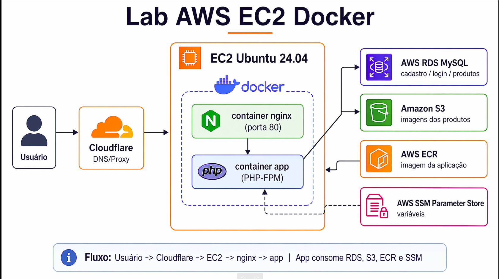

# Aula 10: AWS + EC2 Ubuntu 24.04 + Docker + ECR + RDS + S3 + Nginx + PHP

Este laboratório subiremos uma aplicação PHP simples de e-commerce em uma instância **EC2 Ubuntu 24.04**, usando:

- **Docker Engine + Docker Compose plugin;**
- **Dockerfile multi-stage;**
- **AWS ECR** para armazenar a imagem da aplicação;
- **Docker Compose** para subir `app` + `nginx`;
- **AWS RDS MySQL** como banco externo;
- **Amazon S3** para armazenar as imagens dos produtos;
- **AWS Systems Manager Parameter Store** para injetar variáveis de ambiente;
- **Cloudflare DNS** para publicar o domínio `labphp.skynalytix.com.br`. Nesse caso esse é o meu domínio, no seu lab você pode utilizar outro.

> A aplicação contém:
> - Home com 3 produtos;
> - Página de detalhe do produto;
> - Cadastro de cliente;
> - Login do cliente;
> - Sem checkout e sem carrinho.

## 1) Arquitetura do LAB

```text
Usuário
  |
  v
Cloudflare DNS/Proxy
  |
  v
EC2 Ubuntu 24.04
  |
  +--> Container nginx (porta 80)
  |       |
  |       v
  |    Container app (PHP-FPM)
  |
  +--> AWS RDS MySQL (Cadastro/Login/Produtos)
  |
  +--> Amazon S3 (Imagens dos produtos)
  |
  +--> AWS ECR (Imagem da aplicação)
  |
  +--> AWS SSM Parameter Store (Variáveis)
```



## 2) Recursos AWS que vamos utilizar

### Rede e segurança
- 1 VPC (Usaremos a default para simplificar)
- 1 Security Group da EC2
- 1 Security Group do RDS

### Compute
- 1 EC2 Ubuntu 24.04

### Banco
- 1 RDS MySQL

### Container registry
- 1 Repositório ECR privado: `labphp-app`

### Storage
- 1 Bucket S3 para mídias: `labphpmedia`

### Configuração
- Parâmetros no SSM Parameter Store:
  - `/labphp/prod/APP_IMAGE`
  - `/labphp/prod/APP_NAME`
  - `/labphp/prod/APP_URL`
  - `/labphp/prod/APP_SESSION_NAME`
  - `/labphp/prod/DB_HOST`
  - `/labphp/prod/DB_PORT`
  - `/labphp/prod/DB_NAME`
  - `/labphp/prod/DB_USER`
  - `/labphp/prod/DB_PASSWORD`

## 3) Estrutura do projeto

```text
lab-aws-ec2-docker/
├── app
│   ├── composer.json
│   ├── public
│   │   └── index.php
│   └── src
│       ├── bootstrap.php
│       └── Database.php
├── compose.yaml
├── db
│   └── schema.sql
├── docker
│   └── php
│       ├── Dockerfile
│       └── php.ini
├── iam
│   ├── ec2-instance-role-policy.json
│   └── public-read-policy.json
├── media
│   ├── fone-bluetooth-pro.jpg
│   ├── mochila-urban-tech.jpg
│   └── smartwatch-fit-one.jpg
├── nginx
│   └── default.conf
├── README.md
└── scripts
    └── render-env-from-ssm.sh
```

## 4) Pré-requisitos

### Na sua conta AWS
- EC2
- RDS
- ECR
- S3
- SSM Parameter Store
- IAM Role para a EC2

### Na EC2
- Docker Engine
- Docker Compose plugin
- AWS CLI

## 5) Criando a EC2 Ubuntu 24.04

- **AMI**: Ubuntu Server 24.04 LTS
- **Tipo**: `t3.small`
- **Disco**: 30 GB gp3
- **Security Group EC2**:
  - 22/TCP: Allow Anywhere
  - 80/TCP: Allow http
  - 443/TCP: Allow https

### IAM Role da EC2
Anexe a role do arquivo json: ec2-instance-role-policy.json que permite:

- Pull/push no ECR
- Leitura e escrita no SSM Parameter Store
- Leitura e escrita ao S3 para upload das mídias

## 6) Instalando Docker e AWS CLI na EC2

### Docker

```bash
sudo apt-get update
sudo apt-get install -y ca-certificates curl gnupg

sudo install -m 0755 -d /etc/apt/keyrings
curl -fsSL https://download.docker.com/linux/ubuntu/gpg | sudo gpg --dearmor -o /etc/apt/keyrings/docker.gpg
sudo chmod a+r /etc/apt/keyrings/docker.gpg

echo \
  "deb [arch=$(dpkg --print-architecture) signed-by=/etc/apt/keyrings/docker.gpg] https://download.docker.com/linux/ubuntu \
  $(. /etc/os-release && echo "$VERSION_CODENAME") stable" | \
  sudo tee /etc/apt/sources.list.d/docker.list > /dev/null

sudo apt-get update
sudo apt-get install -y docker-ce docker-ce-cli containerd.io docker-buildx-plugin docker-compose-plugin

sudo systemctl enable docker && \
sudo systemctl start docker

sudo usermod -aG docker ubuntu && \
newgrp docker

sudo systemctl status docker 

docker --version && \
docker compose version
```

### AWS CLI

```bash
sudo apt-get update && \
sudo apt-get install -y unzip curl && \
curl "https://awscli.amazonaws.com/awscli-exe-linux-x86_64.zip" -o "awscliv2.zip" && \
unzip awscliv2.zip && \
sudo ./aws/install && \
aws --version
```

## 7) Criando o ECR

Aqui no caso vou escolher a região `us-east-1` que é mais barato os serviços:

```bash
export AWS_REGION=us-east-1
export AWS_ACCOUNT_ID=$(aws sts get-caller-identity --query Account --output text)
export ECR_REPO=labphp-appc

aws ecr create-repository \
  --region "$AWS_REGION" \
  --repository-name "$ECR_REPO"
```

URI esperada:

```bash
${AWS_ACCOUNT_ID}.dkr.ecr.${AWS_REGION}.amazonaws.com/labphp-app
```


## 8) Clone repo na instância EC2

```bash
git clone https://github.com/pauloferrari-prs/education.git

cd /home/ubuntu/education/lab_guiado/Docker_K8s/aula10/lab-php-ec2-docker

```

## 9) Build da imagem da aplicação

Na raiz do projeto (repo) clonado:

```bash
docker build -f docker/php/Dockerfile -t labphp-app:1.0 .
```

### Tag para o ECR

```bash
export APP_IMAGE=${AWS_ACCOUNT_ID}.dkr.ecr.${AWS_REGION}.amazonaws.com/labphp-app:1.0
docker tag labphp-app:1.0 "$APP_IMAGE"
```

### Login no ECR

```bash
aws ecr get-login-password --region "$AWS_REGION" \
  | docker login --username AWS --password-stdin ${AWS_ACCOUNT_ID}.dkr.ecr.${AWS_REGION}.amazonaws.com
```

### Push

```bash
docker push "$APP_IMAGE"
```

## 10) Criando o RDS MySQL

### RDS MySQL Parâmetros cofiguração
- Engine: MySQL 8.4.8
- Classe: `db.t3.micro`
- Public access: **No**
- Mesmo VPC da EC2 (Usar o Connect to an EC2 compute resource)
- Porta: 3306

### Security Groups

#### SG da EC2
- Saída liberada

#### SG do RDS
- Entrada `3306/TCP` **somente a partir do SG da EC2**

### Banco e usuário
Exemplo:
- DB name: `labphp`
- Username: `labphp_user`
- Password: `sua_senha`

## 11) Criando o schema no RDS

Pegar o endpoint do RDS e rodar o arquivo `db/schema.sql`.

### Via cliente mysql na EC2

```bash
sudo apt-get install -y mysql-client

curl -o global-bundle.pem https://truststore.pki.rds.amazonaws.com/global/global-bundle.pem

#Acessar
mysql -h SEU_RDS_ENDPOINT -P 3306 -u admin -p --ssl-mode=VERIFY_IDENTITY --ssl-ca=./global-bundle.pem
```

```bash
#Criar o user labphp_user

CREATE DATABASE IF NOT EXISTS labphp
  CHARACTER SET utf8mb4
  COLLATE utf8mb4_unicode_ci;

CREATE USER IF NOT EXISTS 'labphp_user'@'%' IDENTIFIED BY 'sua_senha';

GRANT ALL PRIVILEGES ON labphp.* TO 'labphp_user'@'%';

##Preparar o banco de dados
mysql -h SEU_RDS_ENDPOINT -P 3306 -u labphp_user -p --ssl-mode=VERIFY_IDENTITY --ssl-ca=./global-bundle.pem < db/schema.sql
```

## 12) Criando bucket S3 para as imagens dos produtos

### Criar o bucket

```bash
export BUCKET_NAME=labphpmedia
aws s3 mb s3://$BUCKET_NAME --region $AWS_REGION

aws s3api delete-public-access-block \
  --bucket "$BUCKET_NAME" \
  --region "$AWS_REGION"

aws s3api put-bucket-policy \
  --bucket labphpmedia \
  --policy file://./iam/public-read-policy.json \
  --region us-east-1
```

### Estrutura sugerida do bucket

```text
s3://$BUCKET_NAME/products/
├── fone-bluetooth-pro.jpg
├── smartwatch-fit-one.jpg
└── mochila-urban-tech.jpg
```

### Upload

```bash
aws s3 cp ./media/fone-bluetooth-pro.jpg s3://$BUCKET_NAME/products/ && \
aws s3 cp ./media/smartwatch-fit-one.jpg s3://$BUCKET_NAME/products/ && \
aws s3 cp ./media/mochila-urban-tech.jpg s3://$BUCKET_NAME/products/
```

### Trocar a imagem pública na tabela do banco (se aplicável)

Padrão:

```text
https://SEU_BUCKET.s3.REGIAO.amazonaws.com/products/arquivo.jpg
```

UPDATE products
SET image_url = 'https://labphpmedia.s3.us-east-1.amazonaws.com/products/fone-bluetooth-pro.jpg'
WHERE name = 'Fone Bluetooth Pro';

UPDATE products
SET image_url = 'https://labphpmedia.s3.us-east-1.amazonaws.com/products/smartwatch-fit-one.jpg'
WHERE name = 'Smartwatch Fit One';

UPDATE products
SET image_url = 'https://labphpmedia.s3.us-east-1.amazonaws.com/products/mochila-urban-tech.jpg'
WHERE name = 'Mochila Urban Tech';

## 13) Gravando variáveis no SSM Parameter Store

### Exemplo

```bash
aws ssm put-parameter --region $AWS_REGION --name /labphp/prod/APP_IMAGE --type String --value "$APP_IMAGE" --overwrite && \
aws ssm put-parameter --region $AWS_REGION --name /labphp/prod/APP_NAME --type String --value "SkyNalytix Lab PHP" --overwrite && \
aws ssm put-parameter --region $AWS_REGION --name /labphp/prod/APP_URL --type String --value "https://labphp.skynalytix.com.br" --overwrite && \
aws ssm put-parameter --region $AWS_REGION --name /labphp/prod/APP_SESSION_NAME --type String --value "LABPHPSESSID" --overwrite && \
aws ssm put-parameter --region $AWS_REGION --name /labphp/prod/DB_HOST --type String --value "rds_endpoint" --overwrite && \
aws ssm put-parameter --region $AWS_REGION --name /labphp/prod/DB_PORT --type String --value "3306" --overwrite && \
aws ssm put-parameter --region $AWS_REGION --name /labphp/prod/DB_NAME --type String --value "labphp" --overwrite && \
aws ssm put-parameter --region $AWS_REGION --name /labphp/prod/DB_USER --type String --value "labphp_user" --overwrite && \
aws ssm put-parameter --region $AWS_REGION --name /labphp/prod/DB_PASSWORD --type SecureString --value "sua_senha" --overwrite
```

## 14) Gerando o `.env.runtime` a partir do SSM

O script `scripts/render-env-from-ssm.sh` busca os parâmetros (SSM Parameter Store) e gera o arquivo local usado pelo Compose:

```bash
chmod +x scripts/render-env-from-ssm.sh
export AWS_REGION=us-east-1
./scripts/render-env-from-ssm.sh .env.runtime /labphp/prod
```

Exemplo de saída esperada:

```bash
APP_IMAGE=123456789012.dkr.ecr.us-east-1.amazonaws.com/labphp-app:1.0
APP_NAME=SkyNalytix Lab PHP
APP_URL=https://labphp.skynalytix.com.br
APP_SESSION_NAME=LABPHPSESSID
DB_HOST=labphp-mysql.xxxxxx.us-east-1.rds.amazonaws.com
DB_PORT=3306
DB_NAME=labphp
DB_USER=labphp_user
DB_PASSWORD=******
```

## 15) Subindo a aplicação com Docker Compose

```bash
docker compose pull
docker compose up -d
```

### Verificações

```bash
docker compose ps
docker logs labphp-app
docker logs labphp-nginx
curl -I http://127.0.0.1/healthz
curl -I http://127.0.0.1/
```

## 16) Publicando no domínio `labphp.skynalytix.com.br`

Na Cloudflare no DNS Records do seu domínio:

- Crie um registro **A** apontando para o IP público da EC2
- Nome: `labphp`
- Valor: `IP_PUBLICO_DA_EC2`

Depois teste:

```bash
curl -I http://labphp.skynalytix.com.br
```

## 17) Comandos rápidos de troubleshooting

```bash
docker compose ps
docker compose logs -f nginx
docker compose logs -f app
docker inspect labphp-app
docker stats
curl -I http://127.0.0.1/
curl -I http://127.0.0.1/healthz
mysql -h SEU_RDS_ENDPOINT -P 3306 -u labphp_user -p -e "SELECT 1;"
```