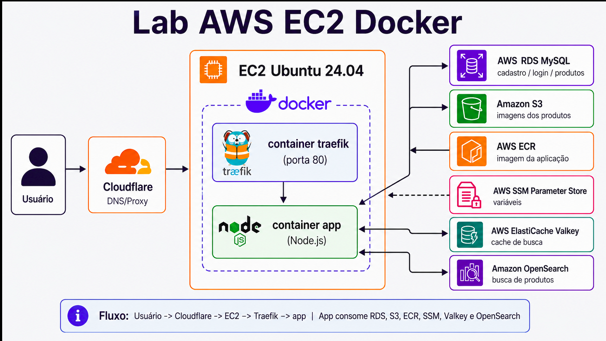

# Aula 11: AWS + EC2 Ubuntu 24.04 + Docker + ECR + RDS + S3 + Traefik + Node.js + Valkey + OpenSearch

Este laboratório sobe uma aplicação **Node.js simples de webcommerce** em uma instância **EC2 Ubuntu 24.04**, usando Docker e serviços gerenciados da AWS.

Neste lab vamos utilizar:

- **EC2 Ubuntu 24.04** para rodar a aplicação com Docker;
- **User Data** para instalar Docker Engine, Docker Compose plugin, AWS CLI, Git, MySQL client e jq;
- **Dockerfile multi-stage** para construir (build) a imagem da aplicação Node.js;
- **AWS ECR** para armazenar a imagem da aplicação;
- **Docker Compose** para subir `app` + `traefik`;
- **Traefik** como reverse proxy/webserver em container;
- **AWS RDS MySQL** como banco externo para produtos, cadastro e login;
- **Amazon S3** para armazenar as imagens dos produtos;
- **AWS Systems Manager Parameter Store** para armazenar as variáveis de ambiente;
- **AWS ElastiCache Valkey** para cache de busca;
- **Amazon OpenSearch Service** como motor de busca de produtos;
- **Cloudflare DNS/Proxy** para publicar o domínio, no meu caso irei publicar o app nessa URL: `SEU_IP_PUBLICO_DA_EC2`.

> A aplicação contém:
>
> - Home com 3 produtos;
> - Página de detalhe do produto;
> - Página de busca de produto;
> - Cadastro de cliente;
> - Login de cliente;
> - API interna simples em `/api/*`;
> - Sem checkout e sem carrinho (cart).

## 1) Arquitetura do LAB



```text
Usuário
  |
  v
Cloudflare DNS/Proxy
  |
  v
SEU_IP_PUBLICO_DA_EC2
  |
  v
EC2 Ubuntu 24.04
  |
  +--> Container Traefik (Porta 80)
  |       |
  |       v
  |    Container app Node.js (Porta interna 3000)
  |
  +--> AWS RDS MySQL (produtos/cadastro/login)
  |
  +--> Amazon S3 (Imagens dos produtos)
  |
  +--> AWS ECR (Imagem Docker da aplicação)
  |
  +--> AWS SSM Parameter Store (Variáveis de ambiente)
  |
  +--> AWS ElastiCache Valkey (Cache de busca)
  |
  +--> Amazon OpenSearch Service ("Motor" de busca)
```

## 2) Fluxo didático da aplicação

```text
Home / Produto
  -> Node.js consulta produtos no RDS MySQL
  -> Node.js renderiza imagens usando URL pública do S3

Busca de produto
  -> Node.js verifica cache no Valkey
  -> Se cache hit: retorna resultado do Valkey
  -> Se cache miss: consulta OpenSearch
  -> Se OpenSearch falhar/não estiver configurado: fallback para MySQL
  -> Resultado é gravado no Valkey com TTL

Cadastro/Login
  -> Node.js grava/consulta clientes no RDS MySQL

Endpoints internos /api/*
  -> Expostos pelo mesmo domínio via Traefik
  -> Exemplo: http://SEU_IP_PUBLICO_DA_EC2/api/products
```

## 3)  OpenSearch e Valkey podem demorar

OpenSearch costuma demorar alguns minutos para fazer o deployment do recruso. Caso não queria esperar ambos subirem a aplicação possui fallback:

- Se Valkey não estiver configurado, a aplicação funciona sem cache;
- Se OpenSearch não estiver configurado, a busca usa MySQL;
- Depois que esses 2 recursos estiverem prontos, basta atualizar o SSM, gerar `.env.runtime` novamente e reiniciar o Compose:

```bash
docker compose down
docker compose up -d
```

## 4) Recursos AWS que vamos utilizar

### Rede e segurança

- 1 VPC, pode ser a default para simplificar;
- 1 Security Group da EC2;
- 1 Security Group do RDS;
- 1 Security Group do Valkey;
- 1 Security Group do OpenSearch.

### Compute

- 1 EC2 Ubuntu 24.04.

### Banco

- 1 RDS MySQL.

### Container registry

- 1 repositório ECR privado: `labnodejs-app`.

### Storage

- 1 bucket S3 para mídias, exemplo: `labnodemedia-ACCOUNT-us-east-1`.

### Cache

- 1 ElastiCache Serverless Valkey: `labnodejs-valkey`.

### Busca

- 1 domínio Amazon OpenSearch Service: `labnodejs-search`.

### Configuração

Parâmetros no SSM Parameter Store:

```text
/labnodejs/prod/AWS_REGION
/labnodejs/prod/APP_IMAGE
/labnodejs/prod/APP_NAME
/labnodejs/prod/APP_URL
/labnodejs/prod/APP_SESSION_NAME
/labnodejs/prod/ADMIN_TOKEN
/labnodejs/prod/DB_HOST
/labnodejs/prod/DB_PORT
/labnodejs/prod/DB_NAME
/labnodejs/prod/DB_USER
/labnodejs/prod/DB_PASSWORD
/labnodejs/prod/DB_SSL
/labnodejs/prod/S3_BUCKET
/labnodejs/prod/S3_REGION
/labnodejs/prod/CACHE_HOST
/labnodejs/prod/CACHE_PORT
/labnodejs/prod/CACHE_TLS
/labnodejs/prod/CACHE_TTL_SECONDS
/labnodejs/prod/OPENSEARCH_ENDPOINT
/labnodejs/prod/OPENSEARCH_USERNAME
/labnodejs/prod/OPENSEARCH_PASSWORD
/labnodejs/prod/OPENSEARCH_INDEX
```

## 5) Estrutura do projeto

```text
lab-nodejs-ec2-docker/
├── app
│   ├── package.json
│   ├── package-lock.json
|   ├── .npmrc
│   ├── public
│   │   └── assets
│   │       └── style.css 
│   └── src
│       ├── cache.js
│       ├── config.js
│       ├── db.js
│       ├── reindex-opensearch.js
│       ├── search.js
│       ├── server.js
│       └── views.js
├── compose.yaml
├── db
│   └── schema.sql
├── docker
│   └── node
│       └── Dockerfile
├── iam
│   ├── ec2-instance-role-policy.json
│   └── s3-public-read-policy-template.json
├── media
│   ├── fone-bluetooth-pro.jpg
│   ├── mochila-urban-tech.jpg
│   └── smartwatch-fit-one.jpg
├── scripts
│   ├── create-opensearch-domain.sh
│   ├── create-valkey-serverless.sh
│   ├── destroy-lab-resources.sh
│   ├── get-opensearch-endpoint.sh
│   └── render-env-from-ssm.sh
├── user-data
│   └── ec2-user-data.sh
├── .env.runtime.example
├── .gitignore
└── README.md
```

## 6) Pré-requisitos

### Na sua conta AWS

- Permissão para criar EC2;
- Permissão para criar RDS MySQL;
- Permissão para criar ECR;
- Permissão para criar S3 bucket;
- Permissão para usar SSM Parameter Store;
- Permissão para criar ElastiCache Valkey;
- Permissão para criar Amazon OpenSearch Service;
- A IAM Role para anexar na EC2.

### Na EC2

O User Data instalará:

- Docker Engine;
- Docker Compose plugin;
- AWS CLI v2;
- Git;
- MySQL client;
- jq.

## 7) Criando a IAM Role da EC2

Crie uma IAM Role para EC2 e anexe uma policy baseada no arquivo:

```text
iam/ec2-instance-role-policy.json
```

Essa policy permite, para fins de lab:

- Criar e usar ECR;
- Criar e usar S3 bucket do lab;
- Ler e gravar parâmetros no SSM;
- Criar e consultar OpenSearch;
- Criar e consultar ElastiCache Valkey;
- Consultar dados básicos de VPC, subnet e security group;
- Criar service-linked role de OpenSearch/ElastiCache, caso necessário.

> Para produção real, a policy deve ser mais restritiva.

## 8) Criando a EC2 Ubuntu 24.04 pelo Console

### Configuração sugerida

- **AMI**: Ubuntu Server 24.04 LTS;
- **Tipo**: `t3.small`;
- **Disco**: 30 GB gp3;
- **IAM Role**: Criar a Role depois de provisionar a instância EC2;
- **VPC**: mesma VPC que será usada para RDS, Valkey e OpenSearch.

### Security Group da EC2

Entrada:

```text
22/TCP   -> Seu IP
80/TCP   -> Anywhere / Cloudflare
8080/TCP -> Seu IP, somente se quiser acessar dashboard inseguro do Traefik no lab
```

> Em produção, não deixe a dashboard insegura do Traefik exposta.

### User Data

Na criação da EC2, cole o conteúdo do arquivo:

```text
user-data/ec2-user-data.sh
```

Depois que a EC2 subir, valide:

```bash
cat /var/log/labnodejs-userdata.done

docker --version
docker compose version
aws --version
git --version
mysql --version
jq --version
```

Se o usuário `ubuntu` ainda não estiver com permissão Docker na sessão atual, saia e entre novamente via SSH.

## 9) Preparando variáveis base na EC2

Acesse a EC2 via SSH e rode:

```bash
export AWS_REGION=us-east-1
export AWS_ACCOUNT_ID=$(aws sts get-caller-identity --query Account --output text)
export ECR_REPO=labnodejs-app
export APP_VERSION=1.0
export APP_DOMAIN=SEU_IP_PUBLICO_DA_EC2
export APP_URL="http://${APP_DOMAIN}"
export PARAM_PREFIX=/labnodejs/prod
```

> Como vou usar a Cloudflare com Flexible SSL, a origem EC2 deixaremos em HTTP/80. O usuário acessa http na Cloudflare, mas a Cloudflare conversa HTTP com a EC2.

## 10) Enviando o projeto para a EC2

```bash
git clone http://github.com/pauloferrari-prs/education.git
```

Na EC2:

```bash
cd /home/ubuntu/education/lab_guiado/Docker_K8s/aula11/lab-nodejs-ec2-docker
```

## 11) Criando o ECR manualmente via AWS CLI

```bash
aws ecr create-repository \
  --region "$AWS_REGION" \
  --repository-name "$ECR_REPO"
```

URI esperada:

```bash
echo "${AWS_ACCOUNT_ID}.dkr.ecr.${AWS_REGION}.amazonaws.com/${ECR_REPO}"
```

## 12) Build multi-stage da imagem Node.js

Na raiz do projeto:

```bash
docker build --no-cache -f docker/node/Dockerfile -t ${ECR_REPO}:${APP_VERSION} .
```

Validar imagem local:

```bash
docker image ls
```

## 13) Login, tag e push para o ECR

```bash
export APP_IMAGE="${AWS_ACCOUNT_ID}.dkr.ecr.${AWS_REGION}.amazonaws.com/${ECR_REPO}:${APP_VERSION}"
export REGISTRY="${AWS_ACCOUNT_ID}.dkr.ecr.${AWS_REGION}.amazonaws.com"

aws ecr get-login-password --region "$AWS_REGION" \
  | docker login --username AWS --password-stdin "$REGISTRY"

docker tag ${ECR_REPO}:${APP_VERSION} "$APP_IMAGE"
docker push "$APP_IMAGE"
```

Validar:

```bash
aws ecr list-images \
  --region "$AWS_REGION" \
  --repository-name "$ECR_REPO" \
  --output table
```

## 14) Criando o RDS MySQL pelo Console

### Configuração sugerida

- Engine: MySQL;
- Versão: MySQL 8.x;
- Template: Free tier
- Classe: `db.t3.micro`;
- Storage: 20 GB gp3;
- Public access: **No**;
- Connect to an EC2 compute resource: Selecionar a instância EC2 que criamos anteriormente;
- Porta: 3306.

### Banco e usuário

Exemplo:

```text
DB name: labnodejs
Master username: admin
Master password: sua_senha_admin
App username: labnodejs_user
App password: sua_senha_app
```

## 15) Iniciando o banco com `schema.sql`

Na EC2, instale o certificado global do RDS:

```bash
curl -o global-bundle.pem http://truststore.pki.rds.amazonaws.com/global/global-bundle.pem
```

Defina o endpoint do RDS:

```bash
export DB_HOST="db-lab-nodejs.c8r6eyuucvi8.us-east-1.rds.amazonaws.com"
export DB_NAME="labnodejs"
export DB_USER="labnodejs_user"
export DB_PASSWORD="sua_senha_app"
```

Acesse com usuário admin:

```bash
mysql -h "$DB_HOST" -P 3306 -u admin -p \
  --ssl-mode=VERIFY_IDENTITY \
  --ssl-ca=./global-bundle.pem
```

Dentro do MySQL:

```sql
CREATE DATABASE IF NOT EXISTS labnodejs CHARACTER SET utf8mb4 COLLATE utf8mb4_unicode_ci;

CREATE USER IF NOT EXISTS 'labnodejs_user'@'%' IDENTIFIED BY 'sua_senha_app';

GRANT ALL PRIVILEGES ON labnodejs.* TO 'labnodejs_user'@'%';
```

Agora rode o schema:

```bash
mysql -h "$DB_HOST" -P 3306 -u "$DB_USER" -p"$DB_PASSWORD" \
  --ssl-mode=VERIFY_IDENTITY \
  --ssl-ca=./global-bundle.pem \
  "$DB_NAME" < db/schema.sql
```

Validar:

```bash
mysql -h "$DB_HOST" -P 3306 -u "$DB_USER" -p"$DB_PASSWORD" \
  --ssl-mode=VERIFY_IDENTITY \
  --ssl-ca=./global-bundle.pem \
  -e "SELECT id, sku, name, price FROM labnodejs.products;"
```

## 16) Criando bucket S3 e subindo imagens manualmente via AWS CLI

### Nome do bucket

Bucket precisa ter nome globalmente único, portanto recomendo colocar a sua AWS Account ID no nome do bucket

```bash
export BUCKET_NAME="labnodemedia-${AWS_ACCOUNT_ID}-${AWS_REGION}"
```

### Criar bucket

Para `us-east-1`:

```bash
aws s3api create-bucket \
  --bucket "$BUCKET_NAME" \
  --region "$AWS_REGION"
```

### Liberar leitura pública para este lab

> Para esse lab, vamos deixar as imagens públicas. Em produção real, normalmente você usaria CloudFront, política mais restritiva, URL assinada ou outro padrão de entrega.

```bash
aws s3api delete-public-access-block \
  --bucket "$BUCKET_NAME" \
  --region "$AWS_REGION"
```

Gerar policy a partir do template:

```bash
sed "s/__BUCKET_NAME__/${BUCKET_NAME}/g" \
  iam/s3-public-read-policy-template.json \
  > /tmp/labnodejs-s3-policy.json
```

Aplicar policy:

```bash
aws s3api put-bucket-policy \
  --bucket "$BUCKET_NAME" \
  --policy file:///tmp/labnodejs-s3-policy.json \
  --region "$AWS_REGION"
```

### Upload das imagens

```bash
aws s3 cp ./media/fone-bluetooth-pro.jpg s3://$BUCKET_NAME/products/ && \
aws s3 cp ./media/smartwatch-fit-one.jpg s3://$BUCKET_NAME/products/ && \
aws s3 cp ./media/mochila-urban-tech.jpg s3://$BUCKET_NAME/products/
```

### Atualizar URLs no banco

```bash
mysql -h "$DB_HOST" -P 3306 -u "$DB_USER" -p"$DB_PASSWORD" \
  --ssl-mode=VERIFY_IDENTITY \
  --ssl-ca=./global-bundle.pem \
  "$DB_NAME" <<SQL
UPDATE products
SET image_url = 'http://${BUCKET_NAME}.s3.${AWS_REGION}.amazonaws.com/products/fone-bluetooth-pro.jpg'
WHERE sku = 'FONE-BT-PRO';

UPDATE products
SET image_url = 'http://${BUCKET_NAME}.s3.${AWS_REGION}.amazonaws.com/products/smartwatch-fit-one.jpg'
WHERE sku = 'SMART-FIT-ONE';

UPDATE products
SET image_url = 'http://${BUCKET_NAME}.s3.${AWS_REGION}.amazonaws.com/products/mochila-urban-tech.jpg'
WHERE sku = 'MOCHILA-URBAN';
SQL
```

## 17) Criando Security Groups para Valkey e OpenSearch

Você pode criar pelo Console ou via CLI.

### Descobrir VPC da EC2

```bash
export EC2_INSTANCE_ID="i-0464c4178206544bc"

export VPC_ID=$(aws ec2 describe-instances \
  --region "$AWS_REGION" \
  --instance-ids "$EC2_INSTANCE_ID" \
  --query 'Reservations[0].Instances[0].VpcId' \
  --output text)

export EC2_SG_ID=$(aws ec2 describe-instances \
  --region "$AWS_REGION" \
  --instance-ids "$EC2_INSTANCE_ID" \
  --query 'Reservations[0].Instances[0].SecurityGroups[0].GroupId' \
  --output text)

echo "$VPC_ID"
echo "$EC2_SG_ID"
```

### Criar SG para Valkey

```bash
export VALKEY_SG_ID=$(aws ec2 create-security-group \
  --region "$AWS_REGION" \
  --group-name labnodejs-valkey-sg \
  --description "SG Valkey labnodejs" \
  --vpc-id "$VPC_ID" \
  --query 'GroupId' \
  --output text)

export VALKEY_SG_ID="sg-057a0134e4151ccc7"

aws ec2 authorize-security-group-ingress \
  --region "$AWS_REGION" \
  --group-id "$VALKEY_SG_ID" \
  --protocol tcp \
  --port 6379 \
  --source-group "$EC2_SG_ID"
```

### Criar SG para OpenSearch

```bash
export OPENSEARCH_SG_ID=$(aws ec2 create-security-group \
  --region "$AWS_REGION" \
  --group-name labnodejs-opensearch-sg \
  --description "SG OpenSearch labnodejs" \
  --vpc-id "$VPC_ID" \
  --query 'GroupId' \
  --output text)

aws ec2 authorize-security-group-ingress \
  --region "$AWS_REGION" \
  --group-id "$OPENSEARCH_SG_ID" \
  --protocol tcp \
  --port 443 \
  --source-group "$EC2_SG_ID"
```

### Subnet da EC2:

#### Adicionando variavel Instance ID:

```bash
TOKEN=$(curl -sX PUT "http://169.254.169.254/latest/api/token" \
  -H "X-aws-ec2-metadata-token-ttl-seconds: 21600")

INSTANCE_ID=$(curl -s \
  -H "X-aws-ec2-metadata-token: $TOKEN" \
  http://169.254.169.254/latest/meta-data/instance-id)

export EC2_SUBNET_ID=$(aws ec2 describe-instances \
  --region "$AWS_REGION" \
  --instance-ids "$INSTANCE_ID" \
  --query 'Reservations[0].Instances[0].SubnetId' \
  --output text)

echo $EC2_SUBNET_ID
```

#### Escolhendo mais 2 subnets para o Valkey (que exige pelo menos 3 subnets para provisionar o recurso)

```bash
aws ec2 describe-subnets \
  --region "$AWS_REGION" \
  --filters "Name=vpc-id,Values=${VPC_ID}" \
  --query 'Subnets[].{SubnetId:SubnetId,AZ:AvailabilityZone,Cidr:CidrBlock}' \
  --output table
```

Configure as variáveis:

```bash
export AWS_REGION=us-east-1
export OPENSEARCH_SUBNET_ID="$EC2_SUBNET_ID"
export VALKEY_SUBNET_IDS="$EC2_SUBNET_ID subnet-a75812c1 subnet-a6ddd1a8"
```

> **Observação:**  
> Para produção, o ideal seria usar subnets privadas para RDS, Valkey e OpenSearch.  
> Para este lab, vamos usar a subnet da EC2 para simplificar o fluxo e controlar o acesso via Security Groups.

---

## 18) Criando ElastiCache Valkey via script

### Criar o Valkey Serverless

```bash
chmod +x scripts/create-valkey-serverless.sh

export CACHE_NAME=labnodejs-valkey
export SUBNET_IDS="$VALKEY_SUBNET_IDS"
export SECURITY_GROUP_IDS="$VALKEY_SG_ID"

./scripts/create-valkey-serverless.sh
```

Carrege as variáveis gerada no arquivo .valkey.env: ```source .valkey.env```

## 19) Criando Amazon OpenSearch Service via script

### Criar o domínio OpenSearch

```bash
chmod +x scripts/create-opensearch-domain.sh

export DOMAIN_NAME=labnodejs-search
export SUBNET_ID="$OPENSEARCH_SUBNET_ID"
export OPENSEARCH_SECURITY_GROUP_ID="$OPENSEARCH_SG_ID"
export OPENSEARCH_MASTER_USER=labnodejs_admin
export OPENSEARCH_MASTER_PASSWORD='SenhaForte123@'

./scripts/create-opensearch-domain.sh
```

Carrege as variáveis gerada no arquivo .opensearch.env: ```source .opensearch.env```

aws opensearch describe-domain \
  --region "$AWS_REGION" \
  --domain-name labnodejs-search \
  --query 'DomainStatus.Endpoints' \
  --output json

## 20) Gravando parâmetros no SSM manualmente via AWS CLI

Depois de ter ECR, RDS, S3, Valkey e OpenSearch, grave as variáveis no Parameter Store.

### Parâmetros gerais

```bash
aws ssm put-parameter --region "$AWS_REGION" --name "${PARAM_PREFIX}/AWS_REGION" --type String --value "$AWS_REGION" --overwrite && \
aws ssm put-parameter --region "$AWS_REGION" --name "${PARAM_PREFIX}/APP_IMAGE" --type String --value "$APP_IMAGE" --overwrite && \
aws ssm put-parameter --region "$AWS_REGION" --name "${PARAM_PREFIX}/APP_NAME" --type String --value "SkyNalytix Lab Node.js" --overwrite && \
aws ssm put-parameter --region "$AWS_REGION" --name "${PARAM_PREFIX}/APP_URL" --type String --value "$APP_URL" --overwrite && \
aws ssm put-parameter --region "$AWS_REGION" --name "${PARAM_PREFIX}/APP_SESSION_NAME" --type String --value "LABNODESESSID" --overwrite && \
aws ssm put-parameter --region "$AWS_REGION" --name "${PARAM_PREFIX}/ADMIN_TOKEN" --type SecureString --value "troque-este-token" --overwrite
```

### Banco RDS

```bash
aws ssm put-parameter --region "$AWS_REGION" --name "${PARAM_PREFIX}/DB_HOST" --type String --value "$DB_HOST" --overwrite && \
aws ssm put-parameter --region "$AWS_REGION" --name "${PARAM_PREFIX}/DB_PORT" --type String --value "3306" --overwrite && \
aws ssm put-parameter --region "$AWS_REGION" --name "${PARAM_PREFIX}/DB_NAME" --type String --value "$DB_NAME" --overwrite && \
aws ssm put-parameter --region "$AWS_REGION" --name "${PARAM_PREFIX}/DB_USER" --type String --value "$DB_USER" --overwrite && \
aws ssm put-parameter --region "$AWS_REGION" --name "${PARAM_PREFIX}/DB_PASSWORD" --type SecureString --value "$DB_PASSWORD" --overwrite && \
aws ssm put-parameter --region "$AWS_REGION" --name "${PARAM_PREFIX}/DB_SSL" --type String --value "false" --overwrite
```

### S3

```bash
aws ssm put-parameter --region "$AWS_REGION" --name "${PARAM_PREFIX}/S3_BUCKET" --type String --value "$BUCKET_NAME" --overwrite && \
aws ssm put-parameter --region "$AWS_REGION" --name "${PARAM_PREFIX}/S3_REGION" --type String --value "$AWS_REGION" --overwrite
```

### Valkey

```bash
aws ssm put-parameter --region "$AWS_REGION" --name "${PARAM_PREFIX}/CACHE_HOST" --type String --value "$CACHE_HOST" --overwrite && \
aws ssm put-parameter --region "$AWS_REGION" --name "${PARAM_PREFIX}/CACHE_PORT" --type String --value "$CACHE_PORT" --overwrite && \
aws ssm put-parameter --region "$AWS_REGION" --name "${PARAM_PREFIX}/CACHE_TLS" --type String --value "$CACHE_TLS" --overwrite && \
aws ssm put-parameter --region "$AWS_REGION" --name "${PARAM_PREFIX}/CACHE_TTL_SECONDS" --type String --value "60" --overwrite
```

### OpenSearch

```bash
aws ssm put-parameter --region "$AWS_REGION" --name "${PARAM_PREFIX}/OPENSEARCH_ENDPOINT" --type String --value "$OPENSEARCH_ENDPOINT" --overwrite && \
aws ssm put-parameter --region "$AWS_REGION" --name "${PARAM_PREFIX}/OPENSEARCH_USERNAME" --type String --value "$OPENSEARCH_USERNAME" --overwrite && \
aws ssm put-parameter --region "$AWS_REGION" --name "${PARAM_PREFIX}/OPENSEARCH_PASSWORD" --type SecureString --value "$OPENSEARCH_PASSWORD" --overwrite && \
aws ssm put-parameter --region "$AWS_REGION" --name "${PARAM_PREFIX}/OPENSEARCH_INDEX" --type String --value "$OPENSEARCH_INDEX" --overwrite
```

## 21) Gerando `.env.runtime` a partir do SSM

```bash
chmod +x scripts/render-env-from-ssm.sh

./scripts/render-env-from-ssm.sh .env.runtime /labnodejs/prod
```

Validar:

```bash
cat .env.runtime
```

Exemplo esperado:

```text
AWS_REGION=us-east-1
APP_IMAGE=123456789012.dkr.ecr.us-east-1.amazonaws.com/labnodejs-app:1.0
APP_NAME=SkyNalytix\ Lab\ Node.js
APP_URL=http://SEU_IP_PUBLICO_DA_EC2
DB_HOST=labnodejs-mysql.xxxxxx.us-east-1.rds.amazonaws.com
DB_PORT=3306
DB_NAME=labnodejs
DB_USER=labnodejs_user
DB_PASSWORD=sua_senha
CACHE_HOST=labnodejs-valkey-xxxxx.serverless.use1.cache.amazonaws.com
OPENSEARCH_ENDPOINT=http://vpc-labnodejs-search-xxxxx.us-east-1.es.amazonaws.com
```

## 22) Pull da imagem do ECR

Como a imagem usada pelo Compose vem do ECR, valide o pull manualmente:

```bash
aws ecr get-login-password --region "$AWS_REGION" \
  | docker login --username AWS --password-stdin "$REGISTRY"

docker pull "$APP_IMAGE"
```

## 23) Subindo aplicação com Docker Compose

```bash
docker compose up -d
```

Verificar containers:

```bash
docker compose ps
```

Logs:

```bash
docker compose logs -f app
```

```bash
docker compose logs -f traefik
```

Testes locais na EC2:

```bash
docker exec labnodejs-app node -e "fetch('http://127.0.0.1:3000/healthz').then(r => console.log(r.status)).catch(console.error)"
curl -I http://127.0.0.1/healthz
curl -I http://127.0.0.1/
curl -s http://127.0.0.1/api/products | jq
curl -s "http://127.0.0.1/api/search?q=fone" | jq
```

## 24) Publicando no Cloudflare

Na Cloudflare, crie um registro DNS:

```text
Type: A
Name: labnodejs
Value: IP_PUBLICO_DA_EC2
Proxy: Enabled / DNS only
```

Se usar Cloudflare Flexible SSL:

```text
Browser -> Cloudflare: http
Cloudflare -> EC2: HTTP/80
```

A aplicação neste lab fica ouvindo HTTP/80 via Traefik.

Teste:

```bash
curl -I http://SEU_IP_PUBLICO_DA_EC2
curl -s http://SEU_IP_PUBLICO_DA_EC2/api/products | jq
```

## 25) Reindexando produtos no OpenSearch manualmente

Depois que a aplicação estiver rodando e o `.env.runtime` tiver OpenSearch configurado:

```bash
docker compose exec app npm run reindex:opensearch
```

Saída esperada:

```text
Indexação concluída. Produtos enviados para o OpenSearch: 3
```

Testar busca:

```bash

curl -I -H "Host: SEU_IP_PUBLICO_DA_EC2" http://127.0.0.1/healthz


curl -s -H "Host: SEU_IP_PUBLICO_DA_EC2" "http://127.0.0.1/api/search?q=fone" "http://SEU_IP_PUBLICO_DA_EC2/api/search?q=fone" | jq
```

Na primeira busca, a fonte deve ser algo como:

```json
{
  "source": "opensearch"
}
```

Na segunda busca igual, a fonte tende a ser:

```json
{
  "source": "valkey-cache"
}
```

## 26) Páginas da aplicação

```text
/                    Home com 3 produtos
/produto/:slug       Detalhe do produto
/busca               Busca de produto
/cadastro            Cadastro de cliente
/login               Login de cliente
/status              Status do lab
/healthz             Healthcheck simples
/readyz              Readiness com DB/cache/OpenSearch
/api/products        API lista produtos
/api/search?q=fone   API busca produtos
/api/customers       API cadastro via JSON
/api/login           API login via JSON
```

## 27) Testes via API interna

### Listar produtos

```bash
curl -s http://SEU_IP_PUBLICO_DA_EC2/api/products | jq
```

### Buscar produto

```bash
curl -s "http://SEU_IP_PUBLICO_DA_EC2/api/search?q=smartwatch" | jq
```

### Cadastrar cliente

```bash
curl -s -X POST http://SEU_IP_PUBLICO_DA_EC2/api/customers \
  -H 'Content-Type: application/json' \
  -d '{"name":"Aluno Docker","email":"aluno@example.com","password":"123456"}' | jq
```

### Login

```bash
curl -s -X POST http://SEU_IP_PUBLICO_DA_EC2/api/login \
  -H 'Content-Type: application/json' \
  -d '{"email":"aluno@example.com","password":"123456"}' | jq
```

## 28) Troubleshooting

### Ver containers

```bash
docker compose ps
```

### Logs da aplicação

```bash
docker compose logs -f app
```

### Logs do Traefik

```bash
docker compose logs -f traefik
```

### Testar Traefik local

```bash
curl -I -H "Host: SEU_IP_PUBLICO_DA_EC2" http://SEU_IP_PUBLICO_DA_EC2/healthz
curl -I -H "Host: SEU_IP_PUBLICO_DA_EC2" http://SEU_IP_PUBLICO_DA_EC2/
```

### Testar DNS/Cloudflare apontando para a EC2

```bash
curl -I http://SEU_IP_PUBLICO_DA_EC2
```

### Testar RDS

```bash
mysql -h "$DB_HOST" -P 3306 -u "$DB_USER" -p"$DB_PASSWORD" \
  --ssl-mode=VERIFY_IDENTITY \
  --ssl-ca=./global-bundle.pem \
  -e "SELECT 1;"
```

### Testar Valkey a partir do container

```bash
docker compose exec app node -e "import('./src/cache.js').then(async c => { console.log(await c.pingCache()); process.exit(0); })"
```

### Testar OpenSearch a partir do container

```bash
docker compose exec app node -e "import('./src/search.js').then(async s => { console.log(await s.pingOpenSearch()); process.exit(0); })"
```

### Ver consumo de recursos

```bash
docker stats
```

### Ver healthcheck do container

```bash
docker inspect labnodejs-app --format '{{json .State.Health}}' | jq
```

## 29) Destroy do lab

Na raiz do projeto:

```bash
chmod +x scripts/destroy-lab-resources.sh
```

Se quiser remover também o bucket S3 pelo script, informe o nome:

```bash
export BUCKET_NAME="labnodemedia-${AWS_ACCOUNT_ID}-${AWS_REGION}"
```

Executar:

```bash
./scripts/destroy-lab-resources.sh
```

O script tenta remover:

- Docker Compose local;
- ElastiCache Valkey;
- Amazon OpenSearch;
- Parâmetros SSM em `/labnodejs/prod`;
- Bucket S3, se `BUCKET_NAME` for informado;
- Repositório ECR.

Remova manualmente pelo Console:

- EC2;
- RDS MySQL;
- Security Groups criados para o lab, se não forem removidos automaticamente;
- Volumes/snapshots que você não quiser manter.

## 30) Observações importantes

- Este lab é didático e não deve ser usado como produção sem ajustes.
- Não usamos Kubernetes/EKS neste lab.
- Não usamos API Gateway neste lab.
- Não usamos `latest` nas imagens!!
- Para produção real, revise IAM, exposição pública do S3, TLS de origem, WAF, backup, observabilidade e alta disponibilidade.