# Aula 6 — Hands On - Subir imagem (Docker) AWS ECR (Elastic Container Registry)

Este guia traz o **passo a passo completo** para subir uma imagem local (Docker) para o AWS ECR (ELastic Container Registry), serviço gerenciado da AWS para armazenar, gerenciar e implantar imagens de contêineres (Docker) de forma segura e escalável.

---

## 0) Pré-requisitos

- Ubuntu **24.04 LTS (Noble)** 64-bit + Docker Instalado
- Acesso `sudo`
- Internet para baixar pacotes/imanges do repositório oficial da Docker / Hub
- Se quiser usar em VM, baixar essa VM (VirtualBox) ubuntu 24.04 com o docker instalado: https://repo-aws-pferrari.s3.us-east-1.amazonaws.com/ubuntulab.ova
- AWS CLI: https://docs.aws.amazon.com/pt_br/cli/latest/userguide/getting-started-install.html

---

## 1) Criar repositório privado na AWS ECR: 

Na sua conta AWS procruar pelo serviço AWS ECR, ou com a mesma logada, acesse esse link: https://us-east-1.console.aws.amazon.com/ecr/private-registry/repositories/create?region=us-east-1

### - 1. Em repository name, devemos colocar dessa forma ```namespace/repo-name``` ou seja, devemos definir qual será o nosso namespace e repo-name:

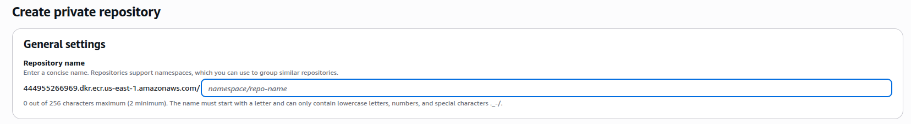

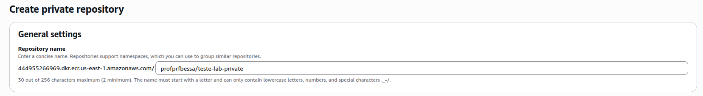

### - 2. Depois devemos definit se a imagem será mutable (As tags das imagens podem ser sobrescrita) ou immutable (As tags das imagens não pode ser sobrescrita). Para nosso lab deixaremos como **Mutable**, mas o recomendado para um ambiente produtivo é definir como **Immutable**

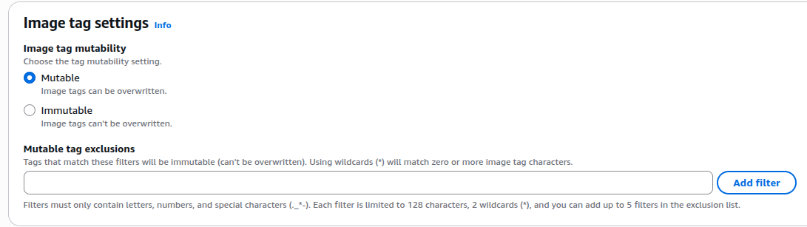

### - 3. Repo criado com sucesso:

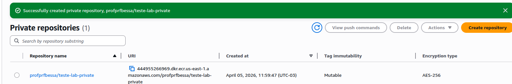

---

## 2) Criar user (serviço) na AWS e atribuir a role correta para utilizar com o AWS ECR:

Antes de subirmos nossa primeira imagem, devemos criar um usuário com as permissões (roles) correta para usarmos para acessar o AWS ECR (Esse usuário inclusive, que será utilizado no nosso fluxo CI/CD - quando for automatizar o build da imagem em uma pipeline)

### - 1. Na AWS, abrir esse caminho: IAM > Users > Create User

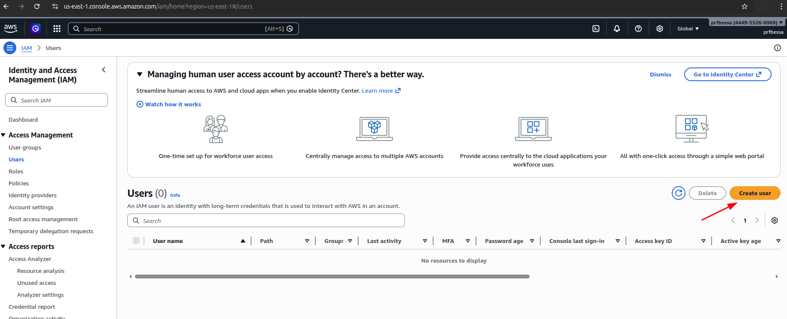

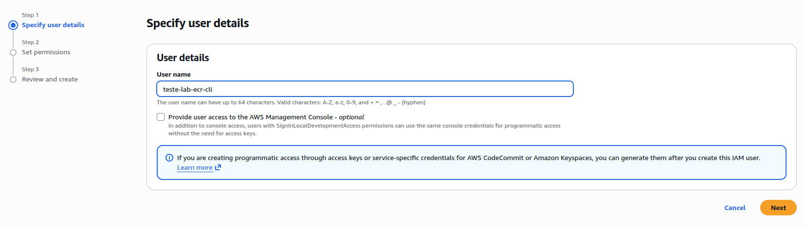


### - 2. Em permissões, deixar sem por enquanto, pois iremos atribuir as permissões ao usuário usando o Inline Policy (json config role file):

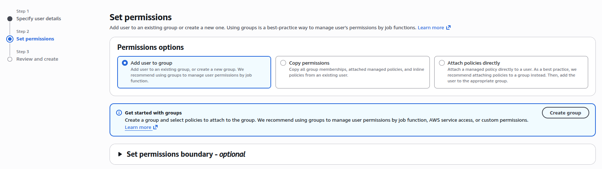

### - 3. Com o usuário criado, abra o mesmo e depois vá em Add Permissions > Create Inline policy

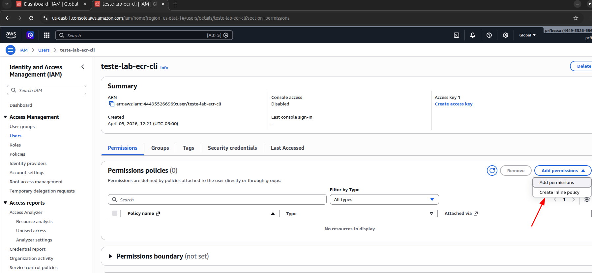

### - 4. Clique em JSON e no Policy editor, copie o conteúdo do arquivo aqui desse repo **aws_ecr_policy.json**: Esse arquivo irá liberar as Roles necessárias para o usuário manipular as imagens no ECR e aqui definirmos apenas o uso do recurso AWS ECR específico do repositório que criamos (Nesse caso, para aumentar a segurança desse usuário, dando apenas acesso ao recurso para qual ele foi criado)

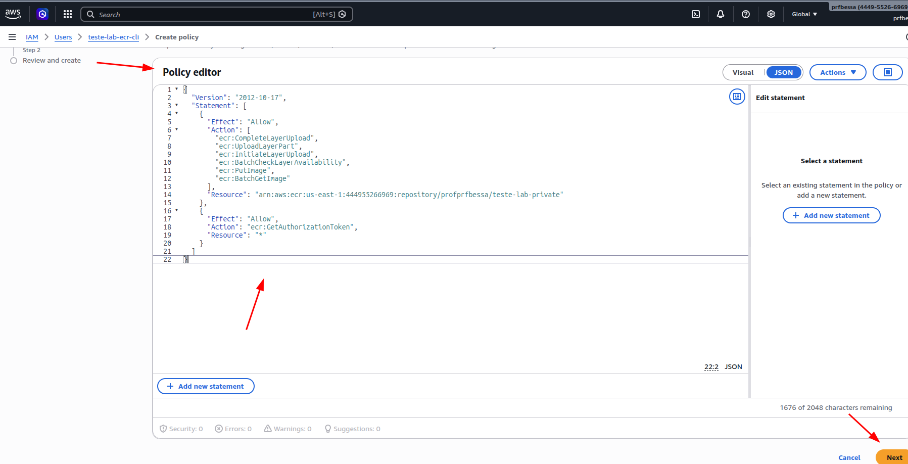

**OBS.:** No seu lab, você deve substituir esse trecho ```"Resource": "arn:aws:ecr:us-east-1:444955266969:repository/profprfbessa/teste-lab-private"``` para os dados da sua conta (Account number AWS) e o namespace/repositório que você definiu.

### - 5. Na próxima página, dê um nome para essa policy criada, e depois confirme a criação da policy clicando em create policy:

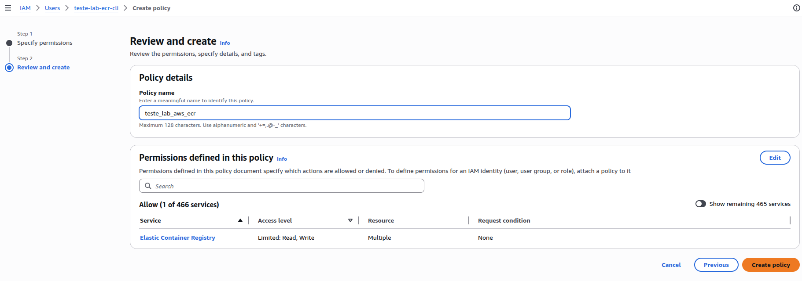

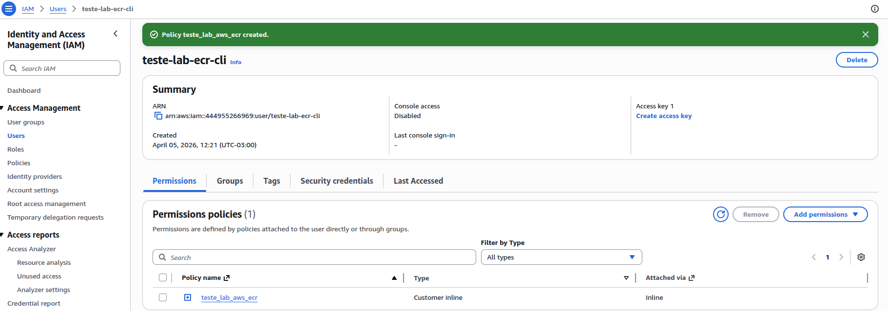

---

## 3) Criar Access Key para o usuário teste-lab-ecr-cli

Com o usuário criado e policy (permissões) atribuídas com sucesso, devemos criar uma Access Key de acesso a esse usuário:

### - 1. No painel da AWS vá em User > Security Credentials > Access Keys > Create access key:

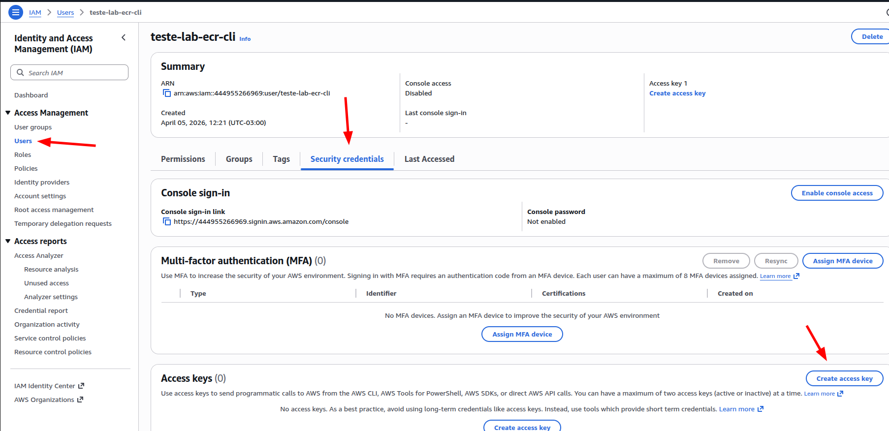

### - 2. Como nosso intenção é utilizar esse usuário apenas para acesso ao AWS CLI, selecione a opção Command Line Interface (CLI):

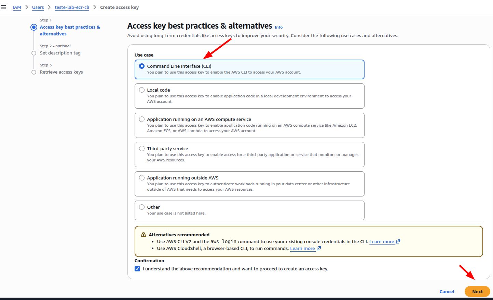

### - 3. Quando a Access key for  criada, lembre de anotar a Access Key e a Secret Access key, pois no caso o valor da Secret só veremos nesse exato momento, depois que você clicar em done, não conseguiremos mais ter acesso ao valor da Secret:

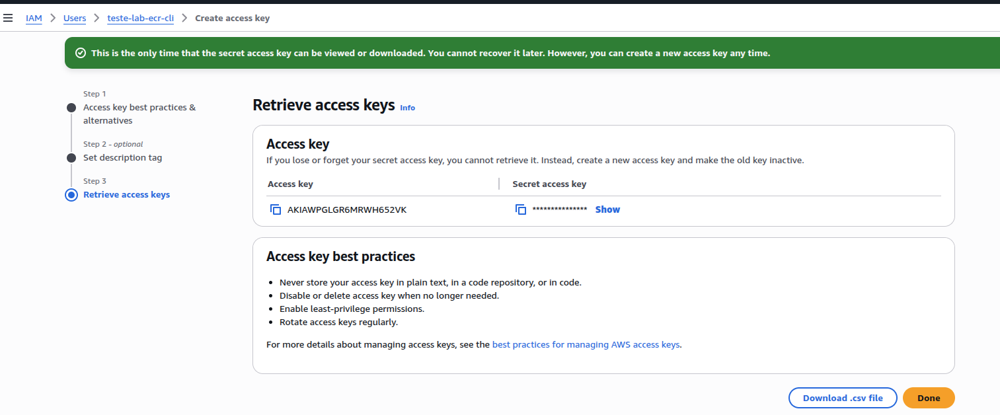

---

## 4) Configurando AWS CLI com o usuário que criamos

Agora vamos configurar o nosso AWS CLI com o acesso (profile) do usuário que criamos para manipular as imagens no nosso AWS ECR:

### - 1. No terminal, digite esse comando: ```aws configure --profile ecr-lab``` lembrando que o profile é personalizável, você que escolher qual nome dar, aqui no caso defini como ecr-lab;

### - 2. Depois o aws-cli pedirá os valores a seguir:
```bash
AWS Access Key ID: Aqui adicionar o valor da Access Key do usuário que criamos
AWS Secret Access Key: Aqui adicionar o valor da Secret do Access key do usuário que criamos
Default region name: us-east-1 , utilizar aqui a região padrão/default
Default region name: json
```
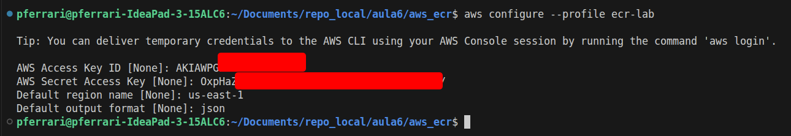

### - 3. Validar o acesso com esse comando: ```aws sts get-caller-identity --profile ecr-lab``` deve retornar o UserId, Account e Arn, conforme a seguir:

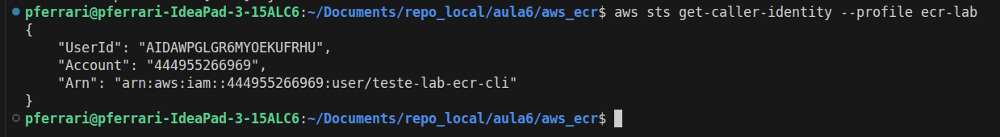

---

## 5) Fazer o login (docker login) no AWS ECR:

Como já estamos com o profile configurado, liberando o acesso a AWS ECR usando o nosos user ```teste-lab-ecr-cli```, agora podemos fazer o login no AWS ECR (docker login)

### - 1. Nesse comando aqui a parte do username deve ser AWS (padrão de acesso - login ao nosso AWS ECR), não confundir e colocar o usuário que criamos via IAM:
```bash
aws ecr get-login-password --region us-east-1 --profile ecr-lab \
| docker login --username AWS --password-stdin 444955266969.dkr.ecr.us-east-1.amazonaws.com
```

Retornando ```Login Succeeded```, o acesso ao AWS ECR foi configurado com sucesso

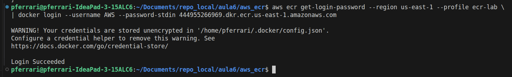

---

## 6) Fazendo o push (envio) da imagem:

Agora que já temos nosso usuário logado no nosso AWS ECR, já podemos realizar o push (envio) da imagem: ```[namespace/account]/[repo]:[tag]```

### - 1. Para esse lab, peguei uma imagem nginx local que criei usando esse lab passado anteriormente: https://github.com/pauloferrari-prs/education/tree/main/lab_guiado/Docker_K8s/aula4/01_Dockerfile_Nginx

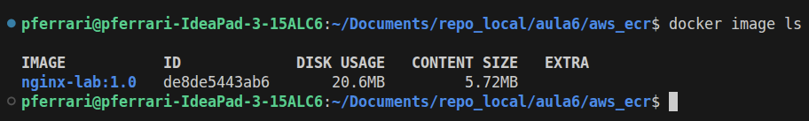


### - 2. Para enviar a imagem corretamente para o nosso AWS ECR, devemos criar uma imagem com a tag correta para enviar ao nosso repo: 

```bash
docker tag nginx-lab:1.0 444955266969.dkr.ecr.us-east-1.amazonaws.com/profprfbessa/teste-lab-private:1.0
```

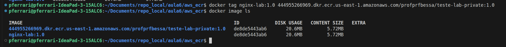

Nesse caso seguindo o modelinho ```[ECR_URI]/[namespace]/[repo]:[tag]```
```bash
ECR_URI: 444955266969.dkr.ecr.us-east-1.amazonaws.com/
namespace: profprfbessa
repo: teste-lab-private
tag: 1.0
```

Se estiver com dúvida, de como pegar o URI do seu repo, segue um exemplo de como pegar essa info no painel da AWS:

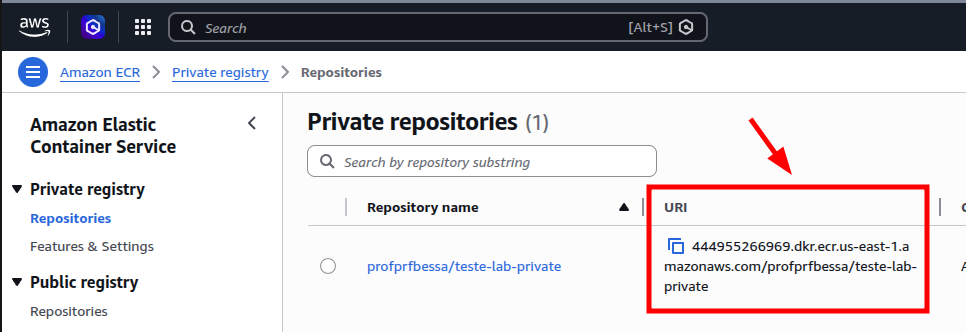

### - 3. Enviando a imagem para o repo no registry (AWS ECR) autenticado:

```bash
docker push 444955266969.dkr.ecr.us-east-1.amazonaws.com/profprfbessa/teste-lab-private:1.0
```

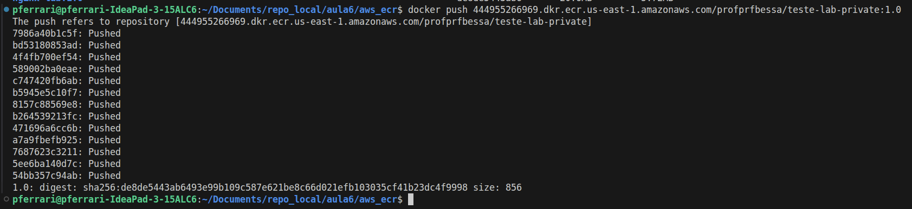

Conforme vemos, a imagem foi enviada com sucesso para o nosso AWS ECR:

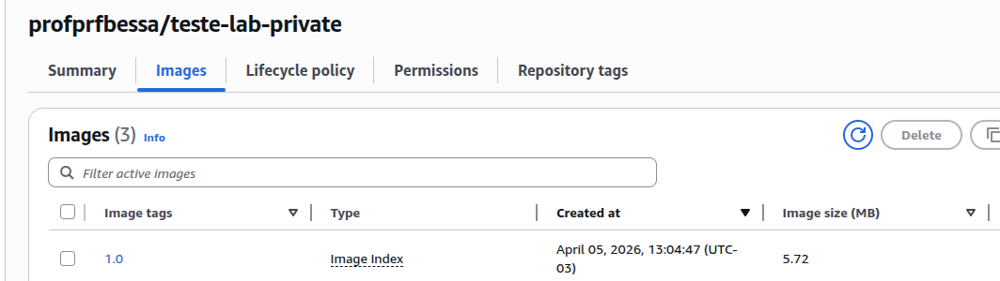


### - 4. Agora conseguimos baixar a imagem do nosso AWS ECR, usando o comando docker pull.

Aqui apaguei a imagem "tageada", para limpar a imagem (não mostrar duplicada), para baixarmos novamente, porém agora direto do nosso AWS ECR:
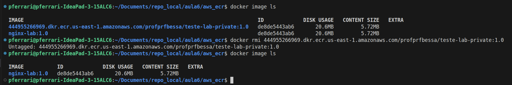

```bash
docker pull 444955266969.dkr.ecr.us-east-1.amazonaws.com/profprfbessa/teste-lab-private:1.0
```

Imagem baixada com sucesso do nosso AWS ECR;

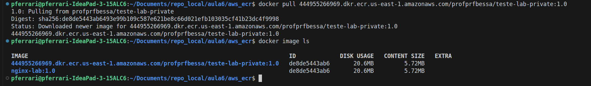

---

## 7) Fazendo logout do nosso AWS ECR (docker logout)

Para irmos para os próximo labs, o ideal é fazermos o docker logout do AWS ECR, com o comando a seguir:

 ```bash
 docker logout 444955266969.dkr.ecr.us-east-1.amazonaws.com
 ```

 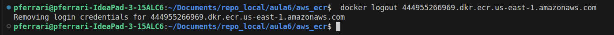