# Aula 6 — Hands On - Subir imagem (Docker) Azure - ACR (Azure Container Registry)

Este guia traz o **passo a passo completo** para subir uma imagem local (Docker) para o ACR (Azure Container Registry), serviço gerenciado da Azure para armazenar, gerenciar e implantar imagens de contêineres (Docker) de forma segura e escalável.

---

## 0) Pré-requisitos

- Ubuntu **24.04 LTS (Noble)** 64-bit + Docker Instalado
- Acesso `sudo`
- Internet para baixar pacotes/imanges do repositório oficial da Docker / Hub
- Se quiser usar em VM, baixar essa VM (VirtualBox) ubuntu 24.04 com o docker instalado: https://repo-aws-pferrari.s3.us-east-1.amazonaws.com/ubuntulab.ova
- Azure CLI: https://learn.microsoft.com/pt-br/cli/azure/install-azure-cli-linux?view=azure-cli-latest&pivots=apt

---

## 1) Criar repositório privado na Azure (ACR):

Na sua conta Azure procurar pelo serviço Azure Container Registry:

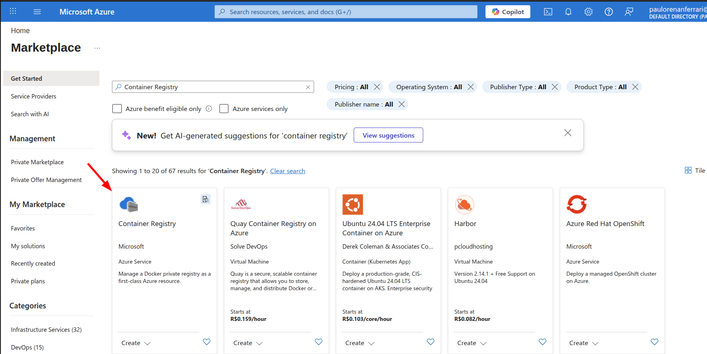

### - 1. Aqui definimos o nome do nosso registry, e selecionamos em qual Resource Group devemos criar o novo recurso (ACR)

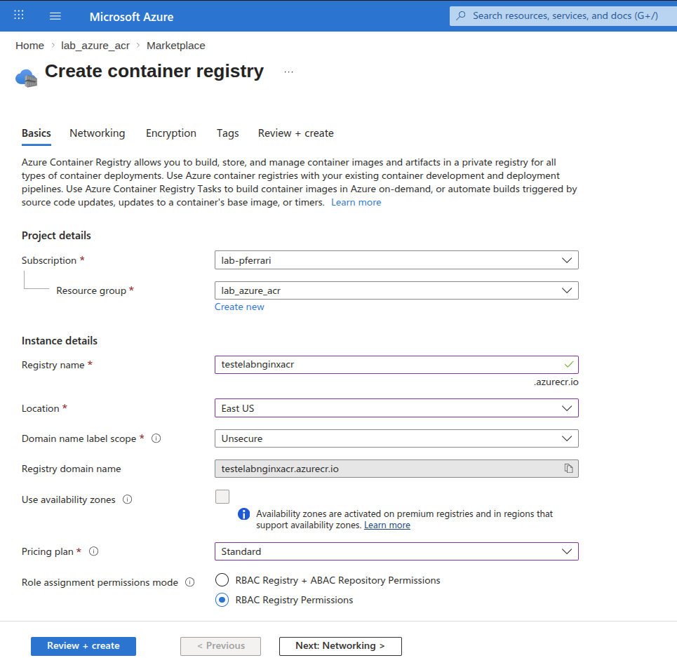

Após definido os valores, clique em Review + Create. Assim que parecer Deployment is Complete, o nosso ACR está pronto para uso:

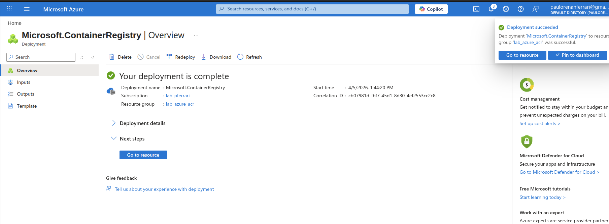

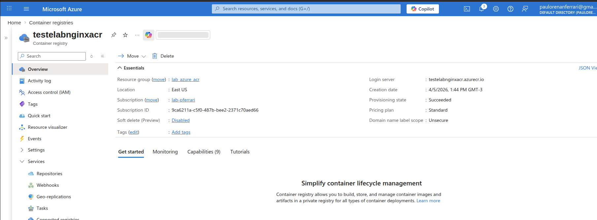

---

## 2) Atribuir permissões de acesso ao nosso usuário:

### - 1. Adicionar Role no IAM (Access Control): ```ACR > Access control (IAM) > Role assignments > Add role assignment```

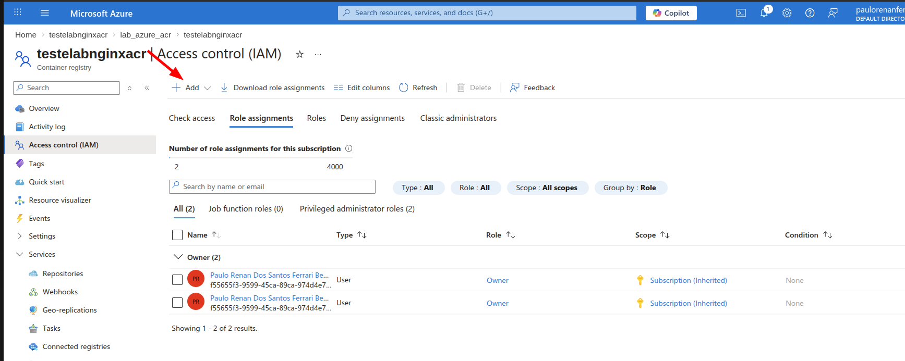

### - 2. Adicionar as seguinte roles ```acr push``` e ```acr pull```

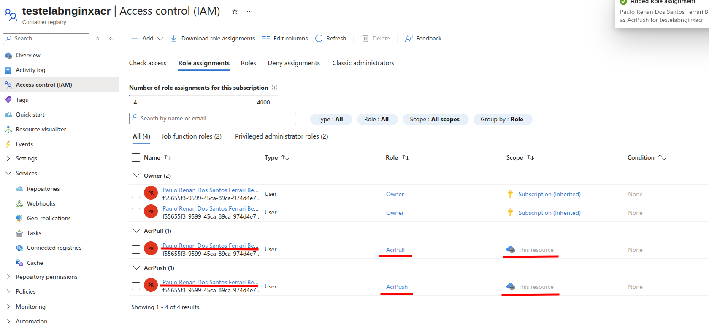

---


## 3) Configurando Azure CLI

Agora vamos configurar o nosso Azure CLI, para manipular as imagens no nosso Azure ACR:

### - 1. No terminal, digite esse comando: ```az login```

### - 2. O Azure cli abrirá automaticamente uma página para que você acesse sua conta Azure (Essa que será efetuada o registro - login no terminal):

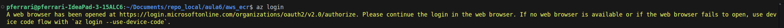
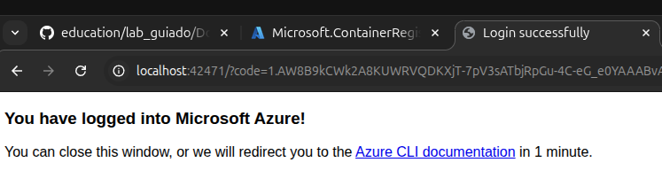

### - 3. Aqui como só temos 1 subscription, não precisa alterar o tenant, pode prosseguir com o Enter (Se tiver mais de 1 Tenant/subscription, selecione qual deseja usar):

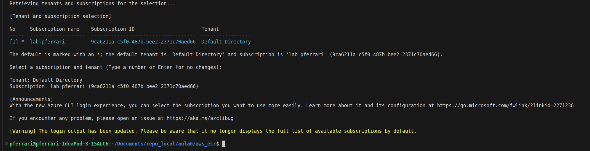

### - 4. Validar o acesso com esse comando: ```az account list``` deve retornar os dados a seguir:

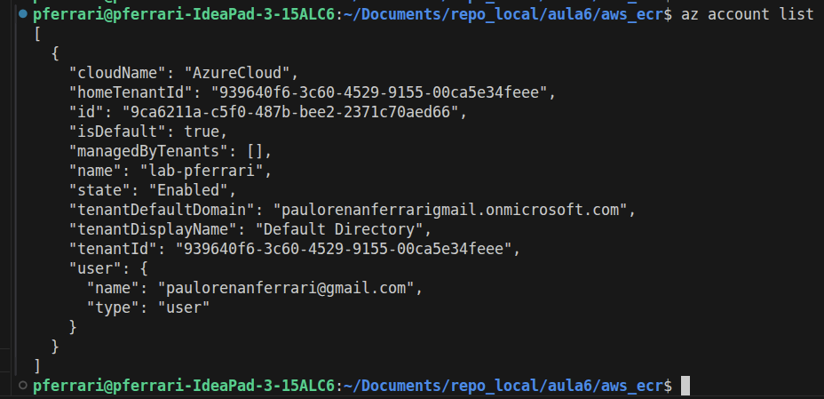

---

## 5) Fazer o login (docker login) no Azure ACR:

Como já estamos com a conta configurado, agora podemos fazer o login no Azure ACR (docker login)

### - 1. ACR Docker login:
```bash
az acr login --name testelabnginxacr2
```

Retornando ```Login Succeeded```, o acesso ao Azure ACR foi configurado com sucesso

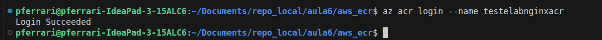

---

## 6) Fazendo o push (envio) da imagem:

Agora que já temos nosso usuário logado no nosso Azure ACR, já podemos realizar o push (envio) da imagem: ```[namespace/account]/[repo]:[tag]```

### - 1. Para esse lab, peguei uma imagem nginx local que criei usando esse lab passado anteriormente: https://github.com/pauloferrari-prs/education/tree/main/lab_guiado/Docker_K8s/aula4/01_Dockerfile_Nginx

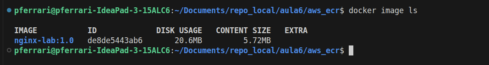

### - 2. Para enviar a imagem corretamente para o nosso Azure ACR, devemos criar uma imagem com a tag correta para enviar ao nosso repo: 

```bash
docker tag nginx-lab:1.0 testelabnginxacr2.azurecr.io/profprfbessa/teste-lab-private:1.0
```

Nesse caso seguindo o modelo ```[ACR_DNS]/[namespace]/[repo]:[tag]```
```bash
ACR_DNS: testelabnginxacr2.azurecr.io
namespace: profprfbessa
repo: teste-lab-private
tag: 1.0
```
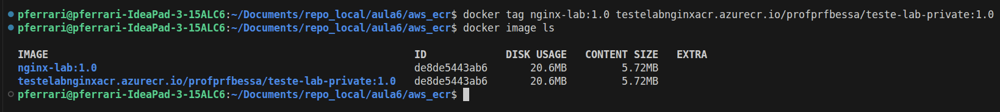


Se estiver com dúvida, de como pegar o DNS do seu ACR, segue um exemplo de como pegar essa info no painel da Azure:

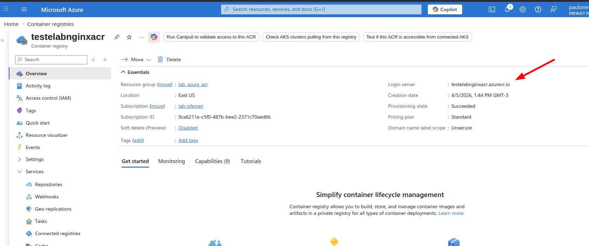

### - 3. Enviando a imagem para o repo no registry (Azure ACR) autenticado:

```bash
docker push testelabnginxacr2.azurecr.io/profprfbessa/teste-lab-private:1.0
```

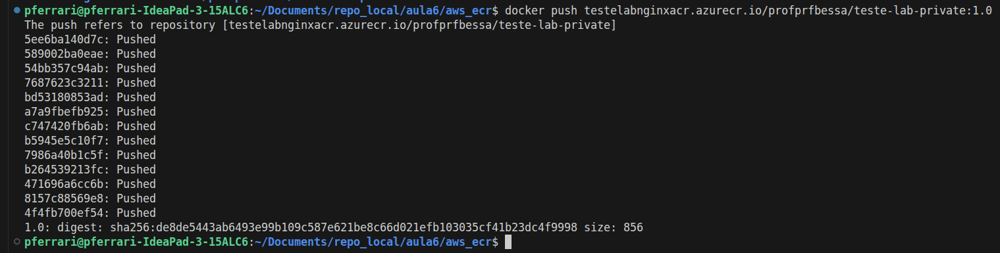

Conforme vemos, a imagem foi enviada com sucesso para o nosso Azure ACR:

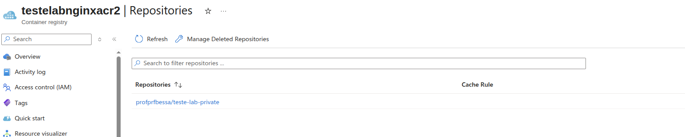


### - 4. Agora conseguimos baixar a imagem do nosso Azure ACR, usando o comando docker pull.

Aqui apaguei a imagem "tageada", para limpar a imagem (não mostrar duplicada), para baixarmos novamente, porém agora direto do nosso Azure ACR:

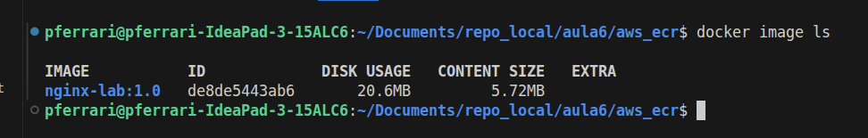


```bash
docker pull testelabnginxacr2.azurecr.io/profprfbessa/teste-lab-private:1.0
```

Imagem baixada com sucesso do nosso Azure ACR;

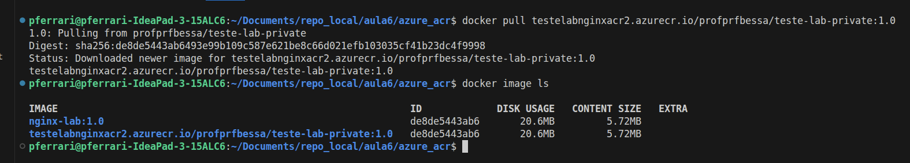

---

## 7) Fazendo logout do nosso Azure ACR (docker logout)

Para irmos para os próximo labs, o ideal é fazermos o docker logout do Azure ACR, com o comando a seguir:

 ```bash
docker logout testelabnginxacr2.azurecr.io
 ```

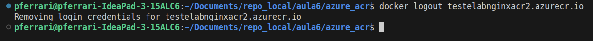