# Aula 6 — Hands On - Subir imagem (Docker) usando o Docker hub

Este guia traz o **passo a passo completo** para subir uma imagem local (Docker) para o Docker Hub (Container Registry oficial da Docker Inc.), serviço gerenciado pela Docker Inc. para armazenar, gerenciar e implantar imagens de contêineres (Docker) de forma segura e escalável.

---

## 0) Pré-requisitos

- Ubuntu **24.04 LTS (Noble)** 64-bit + Docker Instalado
- Acesso `sudo`
- Internet para baixar pacotes/imanges do repositório oficial da Docker / Hub
- Se quiser usar em VM, baixar essa VM (VirtualBox) ubuntu 24.04 com o docker instalado: https://repo-aws-pferrari.s3.us-east-1.amazonaws.com/ubuntulab.ova

---

## 1) Criar Repositório privado no Docker Hub:

### - 1. Crie uma conta no Docker hub, e acesso o link a seguir: https://hub.docker.com/repositories/

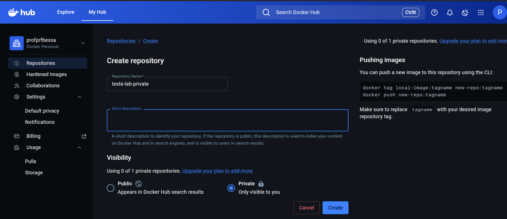

---

## 2) Criar token de acesso pessoal (PAT)

Com o repositório criado, devemos criar uma chave (token) de acesso pessoal a conta Docker, com isso dando permissão de acesso ao nosso Repositório criado via docker login:

### - 1. Acesse sua conta Docker e vá em: ```Account Settings > Personal access tokens > Generate new token: 

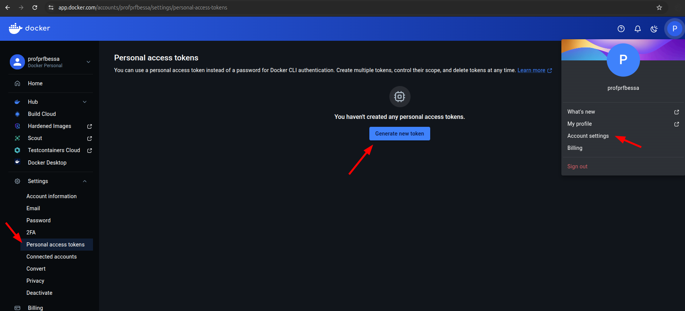


### - 2. Crie o PAT com as seguintes opções:

```bash
Access tokem description: Nome para o seu PAT
Expiration date: Aqui pode deixar como none, ou definir uma data de expiração (Para ambiente produtivos, o recomendado é definir uma data de expiração)
Access permission: Read & Write
```

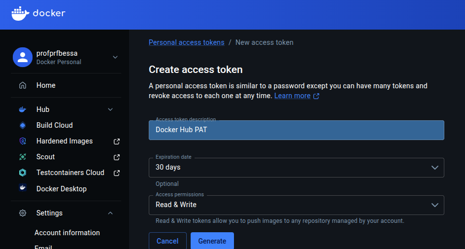

### - 3. Quando o PAT for criado, lembre de anotar a password, pois no caso o valor da password só veremos nesse exato momento, depois que você sair dessa página, não conseguiremos mais ter acesso ao valor da password:

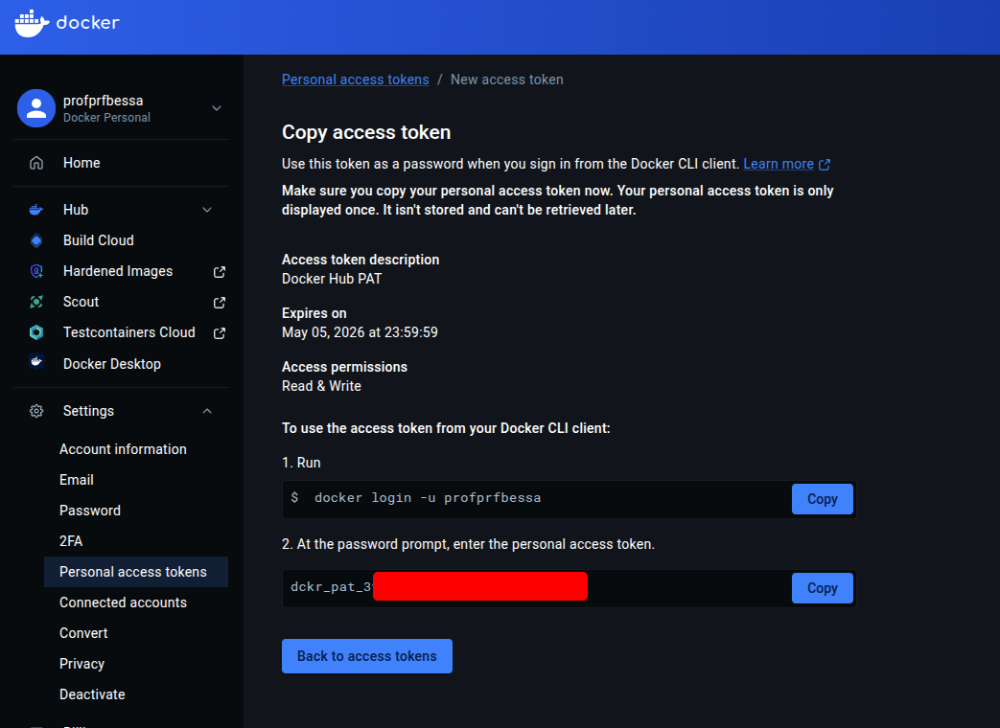

---


## 3) Autenticando no docker hub via terminal (docker login)

Agora vamos adicionar o nosso login no docker, para manipular as imagens usando o docker hub:

### - 1. No terminal, digite esse comando: ```docker login -u <user>``` e em password, colocar a que foi gerada pelo PAT:

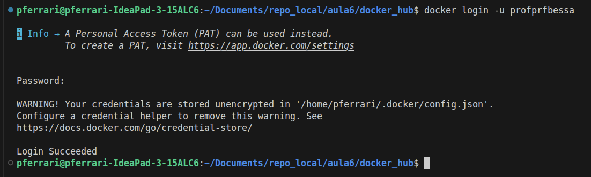

Retornando ```Login Succeeded```, o acesso ao Docker Hub foi configurado com sucesso

---

## 4) Fazendo o push (envio) da imagem:

Agora que já temos nosso usuário logado no nosso Docker Hub, já podemos realizar o push (envio) da imagem: ```[namespace/account]/[repo]:[tag]```

### - 1. Para esse lab, peguei uma imagem nginx local que criei usando esse lab passado anteriormente: https://github.com/pauloferrari-prs/education/tree/main/lab_guiado/Docker_K8s/aula4/01_Dockerfile_Nginx

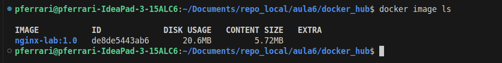

### - 2. Para enviar a imagem corretamente para o nosso Docker Hub, devemos criar uma imagem com a tag correta para enviar ao nosso repo: 

```bash
docker tag nginx-lab:1.0 profprfbessa/teste-lab-private:1.0
```

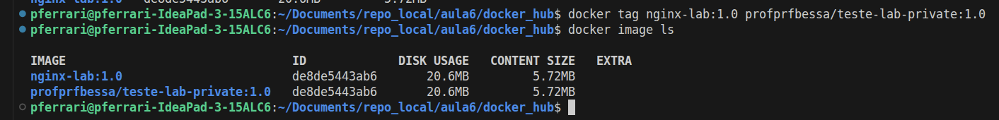

Nesse caso seguindo o modelo ```[namespace]/[repo]:[tag]```
```bash
namespace: profprfbessa
repo: teste-lab-private
tag: 1.0
```

### - 3. Enviando a imagem para o repo criado no Docker Hub:

```bash
docker push profprfbessa/teste-lab-private:1.0
```

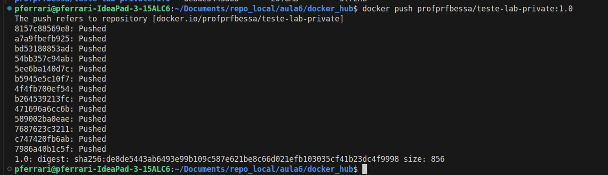

Conforme vemos, a imagem foi enviada com sucesso para o nosso repositório no Docker Hub:

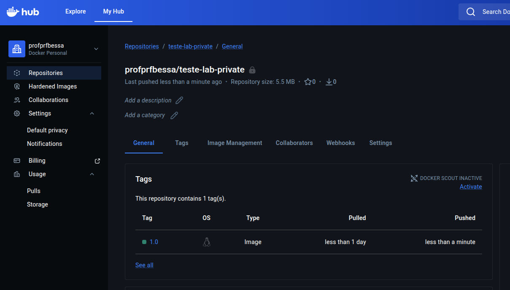

### - 4. Agora conseguimos baixar a imagem do nosso repo no Docker Hub, usando o comando docker pull.

Aqui apaguei a imagem "tageada", para limpar a imagem (não mostrar duplicada), para baixarmos novamente, porém agora direto do nosso repo no Docker Hub:

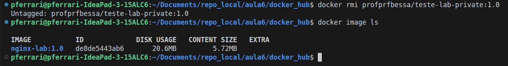

```bash
docker pull profprfbessa/teste-lab-private:1.0
```
Imagem baixada com sucesso do nosso Repo do Docker Hub:

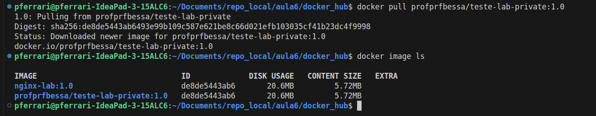

---

## 7) Fazendo logout do Docker Hub (docker logout)

Para irmos para os próximo labs, o ideal é fazermos o docker logout do Docker Hub, com o comando a seguir:

 ```bash
docker logout
 ```

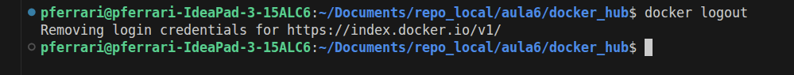