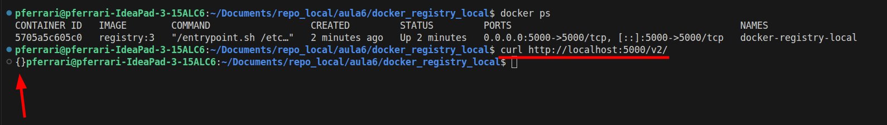
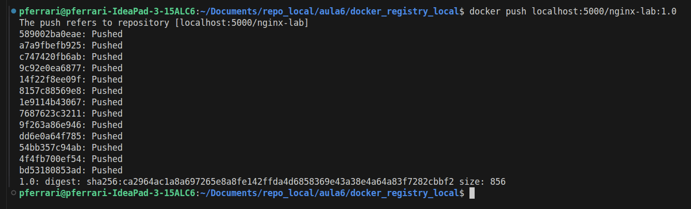
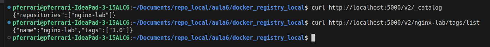
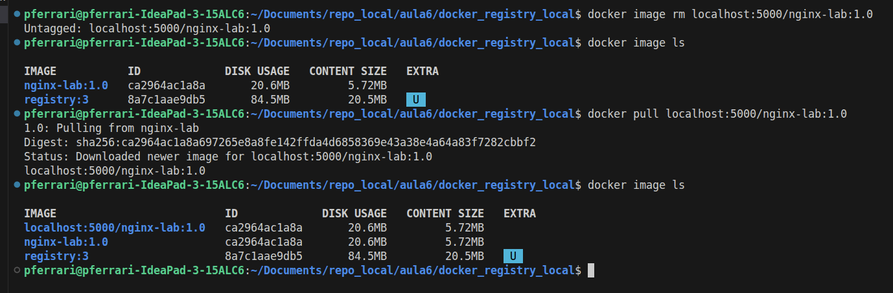

# Aula 6 — Hands On - Subir imagem (Docker) usando o Docker Registry

Este laboratório mostra, de forma prática, como **publicar uma imagem Docker em um Docker Registry local** rodando na sua própria VM.

A ideia é simular um fluxo muito comum no dia a dia: **criar uma imagem**, **versioná-la com tag**, **enviá-la para um registry** e depois **baixá-la novamente** para uso.

## O que é um Docker Registry?

O **Docker Registry** é um serviço usado para **armazenar e distribuir imagens Docker**.

Exemplos comuns:

- Docker Hub
- Amazon ECR (Elastic Container Registry)
- Azure Container Registry (ACR)
- Harbor
- Registry local (como neste laboratório)

Neste exercício, vamos usar um **registry local**, ideal para estudo, testes e ambientes internos.

## 0) Pré-requisitos

Antes de começar, garanta que você tenha:

- **Ubuntu 24.04 LTS (64 bits)**;
- **Docker instalado e funcionando**;
- Permissão para executar comandos com `sudo`;
- Acesso à internet para baixar imagens do Docker Hub.

#### VM pronta para laboratório

Caso queira usar uma VM já preparada para a aula, **Download da VM (VirtualBox):** https://repo-aws-pferrari.s3.us-east-1.amazonaws.com/ubuntulab.ova

## 1) Criar a pasta de persistência do registry

Vamos criar uma pasta local para armazenar os dados do registry.

```bash
mkdir registry-data
```

### Por que isso é importante?

Sem esse volume, as imagens enviadas ao registry seriam perdidas caso o container fosse removido.


## 2) Subir o container do Docker Registry

Agora vamos iniciar o registry local em um container Docker:

```bash
docker run -d \
  --name docker-registry-local \
  --restart always \
  -p 5000:5000 \
  -v "$PWD/registry-data:/var/lib/registry" \
  registry:3
```

### Explicando os principais parâmetros

- `-d`: Executa o container em segundo plano (detached mode);
- `--name docker-registry-local`: Define um nome para o container;
- `--restart always`: Reinicia o container automaticamente;
- `-p 5000:5000`: Expõe a porta 5000 da VM/Host para a porta 5000 do container;
- `-v "$PWD/registry-data:/var/lib/registry"`: Salva os dados do registry na pasta local criada anteriormente;
- `registry:3`: Imagem oficial do Docker Registry.

## 3) Validar se o registry está funcionando

Use o comando abaixo para verificar se o serviço respondeu corretamente:

```bash
curl http://localhost:5000/v2/
```

### Resultado esperado

Se estiver tudo certo, o retorno normalmente será algo parecido com:

```bash
{}
```
Isso indica que a API do registry está ativa.



## 4) Aplicar tag na imagem local

Agora vamos marcar a imagem local `nginx-lab:1.0` com o endereço do nosso registry local:

```bash
docker tag nginx-lab:1.0 localhost:5000/nginx-lab:1.0
```

### O que esse comando faz?

Ele cria uma nova referência para a mesma imagem, agora apontando para o registry local em `localhost:5000`.

Em outras palavras, a imagem passa a ficar pronta para ser enviada ao seu repositório local.

---

## 5) Enviar a imagem para o registry local

Com a tag aplicada, envie a imagem:

```bash
docker push localhost:5000/nginx-lab:1.0
```

### O que acontece aqui?

O Docker enviou a imagem para o registry local.

Se tudo ocorrer bem, você verá mensagens indicando o envio das layers e, ao final, o digest da imagem.



---

## 6) Validar se a imagem foi enviada

Podemos consultar o catálogo do registry para listar os repositórios existentes:

```bash
curl http://localhost:5000/v2/_catalog
```

Para listar as tags disponíveis do repositório `nginx-lab`:

```bash
curl http://localhost:5000/v2/nginx-lab/tags/list
```

### Resultado esperado

Você deverá ver algo semelhante a:

```json
{"repositories":["nginx-lab"]}
```

E também:

```json
{"name":"nginx-lab","tags":["1.0"]}
```



---

## 7) Fazer o download da imagem do registry

Primeiro apagar a imagem com a tag: 

```bash
docker image rm localhost:5000/nginx-lab:1.0
```

Agora vamos testar o caminho inverso, baixando a imagem a partir do registry:

```bash
docker pull localhost:5000/nginx-lab:1.0
```



### Por que esse teste é importante?

Porque ele comprova que a imagem realmente foi publicada e pode ser consumida novamente por outros ambientes ou hosts.

---

## 8) Executar um container usando a imagem publicada

Com a imagem armazenada no registry, execute um container com ela:

```bash
docker run -d --name nginx-local-registry -p 8080:8080 localhost:5000/nginx-lab:1.0
```

---

## 9) Testar a aplicação

Agora valide se o container está respondendo:

```bash
curl -i http://localhost:8080
```

Se a sua imagem estiver correta e expondo a aplicação na porta `8080`, você verá a resposta HTTP (200 - OK) da aplicação.