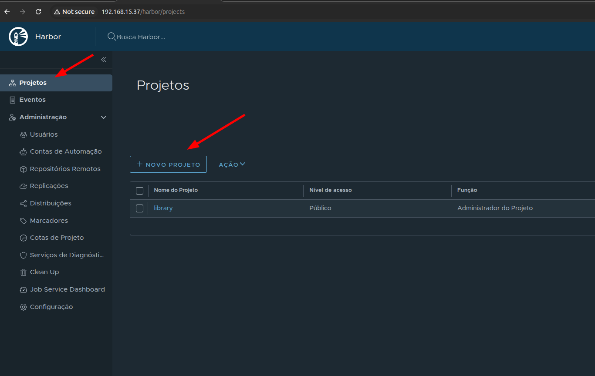
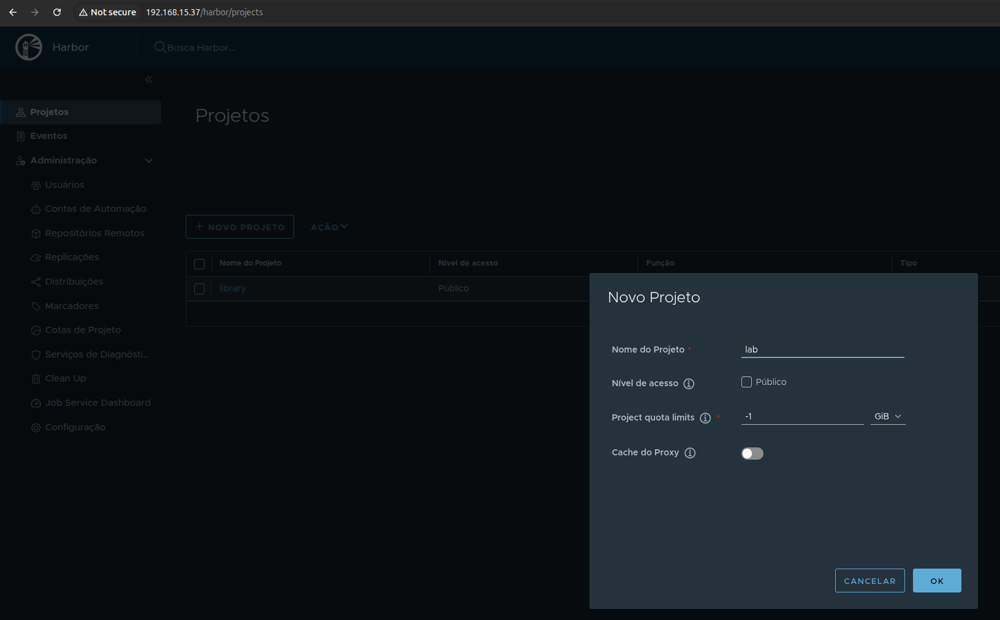
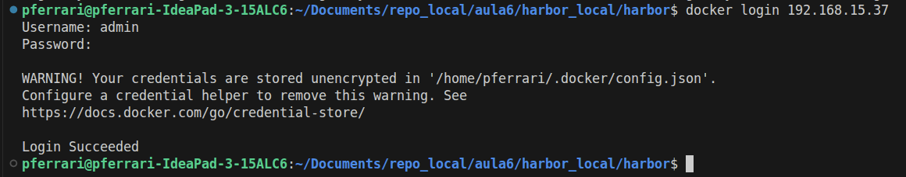
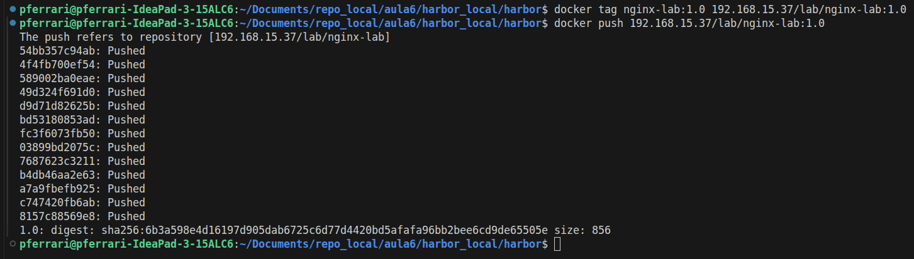
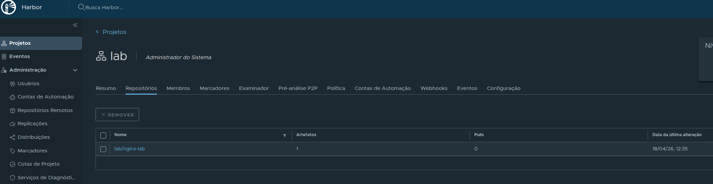
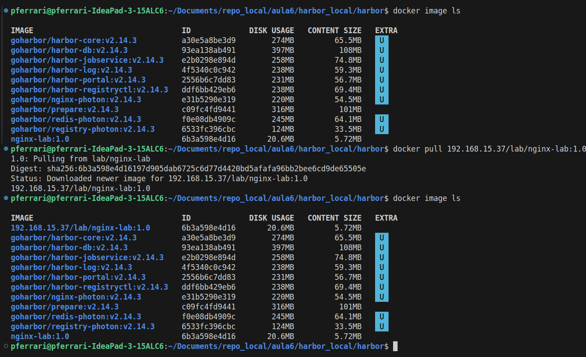

# Aula 6 — Hands On: Subindo imagens no Harbor local

Este laboratório mostra o **passo a passo para instalar o Harbor localmente em uma VM**, criar um projeto, fazer login no registry, enviar uma imagem Docker e depois baixá-la novamente para validação.

O Harbor é um **registry privado** com interface web, gerenciamento de projetos, controle de acesso e recursos extras para gestão de imagens.

## Pré-requisitos

Antes de começar, garanta que sua VM possui:

- Ubuntu com Docker instalado;
- acesso `sudo`;
- internet para baixar os arquivos do Harbor;
- uma imagem local já criada para teste, por exemplo: `nginx-lab:1.0`.

> Neste laboratório foi usado como exemplo o instalador online do Harbor `v2.14.3`. Você pode adaptar para outra versão estável, se desejar.

## 1) Preparar o diretório de trabalho

Crie a pasta do laboratório e entre nela:

```bash
mkdir -p ~/Documents/harbor_local
cd ~/Documents/harbor_local
```

## 2) Baixar o instalador do Harbor

Baixe o pacote do instalador online:

```bash
curl -LO https://github.com/goharbor/harbor/releases/download/v2.14.3/harbor-online-installer-v2.14.3.tgz
```

Extraia o arquivo e entre no diretório do Harbor:

```bash
tar -xzf harbor-online-installer-v2.14.3.tgz
cd harbor
```

## 3) Descobrir o IP local da VM

O Harbor será acessado pelo IP da máquina. Para descobrir o IP local:

```bash
hostname -I | awk '{print $1}'
```

Exemplo de resultado:

```bash
192.168.15.37
```

> Esse IP será usado no arquivo de configuração do Harbor e também nos comandos de login, push e pull.


## 4) Configurar o arquivo `harbor.yml`

Copie o arquivo de modelo:

```bash
cp harbor.yml.tmpl harbor.yml
```

Edite o arquivo:

```bash
nano harbor.yml
```

Ajuste os principais parâmetros:

```yaml
hostname: 192.168.15.37

http:
  port: 80

# https:
#   port: 443
#   certificate: /your/certificate/path
#   private_key: /your/private/key/path

harbor_admin_password: Harbor12345

data_volume: /home/<seu-user>/Documents/harbor_local/data
```

### O que cada campo faz

- `hostname`: IP ou Nome (DNS) usado para acessar o Harbor;
- `http.port`: Porta HTTP do serviço;
- `harbor_admin_password`: Senha inicial do usuário `admin`;
- `data_volume`: Caminho onde os dados persistentes do Harbor ficarão armazenados.

> Neste laboratório o Harbor foi configurado com HTTP na porta 80, senha `Harbor12345` e volume persistente em `/home/<seu-user>/Documents/harbor_local/data`.

## 5) Permitir registry HTTP no Docker daemon

Como o laboratório usa **HTTP** em vez de HTTPS, o Docker precisa confiar nesse registry como `insecure-registry`.

Crie o diretório de configuração do Docker, se necessário:

```bash
sudo mkdir -p /etc/docker
```

Crie ou sobrescreva o arquivo `daemon.json`:

```bash
sudo tee /etc/docker/daemon.json >/dev/null <<'EOF'
{
  "insecure-registries": ["192.168.15.37"]
}
EOF
```

Reinicie o Docker:

```bash
sudo systemctl restart docker
```

Valide a configuração:

```bash
docker info | grep -A 5 "Insecure Registries"
```

> Ajuste o IP conforme o endereço da sua VM.

## 6) Instalar o Harbor

Dentro da pasta `harbor`, execute a instalação inicial:

```bash
sudo ./install.sh
```

Esse processo cria e sobe os serviços do Harbor via Docker Compose.

Depois, verifique se os containers estão em execução:

```bash
docker compose ps
```

## 7) Acessar o Harbor no navegador

Abra o navegador e acesse:

```text
http://192.168.15.37
```

Login padrão configurado no laboratório:

```text
usuário: admin
senha: Harbor12345
```

> No seu ambiente, substitua pelo IP da sua VM.

## 8) Criar um projeto no Harbor

Após logar na interface web:

- Acesse **Projetos**;
- Clique em **Novo Projeto**;
- Crie um projeto chamado `lab`.

Esse projeto será usado para armazenar a imagem do laboratório.





### O que é cada campo (opção) de um novo projeto no Harbor:

- `Nome do projeto`: Nome que deseja colocar no projeto (geralmente adicionamos o nome do ambiente - prd, stg, dev...);
- `Nível de acesso`: Se quer liberar o registry para acesso público, marque essa opção. Com isso o usuário não precisa executar o `docker login` para baixar as imagens do projeto;
- `Project quota limits`: Se quiser definir um tamanho máximo que esse projeto pode ocupar, configure um valor aqui. Caso contrário deixar o default `-1` que é igual a ilimitado (Ou até onde o disco da sua VM "aguentar");
- `Cache do proxy`: Habilite caso você queira que esse projeto seja um cache local para outros repositórios remotos (registries).

## 9) Fazer login no Harbor via Docker CLI

No terminal, execute:

```bash
docker login 192.168.15.37
```

Informe o usuário e senha:

- usuário: `admin`
- senha: `Harbor12345`

Se tudo estiver correto, o Docker retornará algo semelhante a:

```text
Login Succeeded
```



## 10) Marcar a imagem com a tag do Harbor

Agora vamos preparar a imagem local para envio ao projeto `lab`.

```bash
docker tag nginx-lab:1.0 192.168.15.37/lab/nginx-lab:1.0
```

### Entendendo a tag

A estrutura é:

```text
IP_DO_HARBOR/NOME_DO_PROJETO/NOME_DA_IMAGEM:TAG
```

Neste caso:

- `192.168.15.37` → Endereço do Harbor;
- `lab` → Projeto criado na interface;
- `nginx-lab` → Nome da imagem;
- `1.0` → Versão da imagem.

## 11) Enviar a imagem para o Harbor

Faça o push da imagem:

```bash
docker push 192.168.15.37/lab/nginx-lab:1.0
```

Depois disso, a imagem deverá aparecer no projeto `lab` dentro da interface web do Harbor.





## 12) Testar novo download

Para provar que a imagem está realmente armazenada no Harbor, remova a cópia local com a tag do Harbor:

```bash
docker rmi 192.168.15.37/lab/nginx-lab:1.0
```

Agora baixe novamente do Harbor:

```bash
docker pull 192.168.15.37/lab/nginx-lab:1.0
```

Se o download funcionar, significa que o push foi realizado com sucesso.



## 13) Executar um container usando a imagem do Harbor

Agora rode um container com a imagem hospedada no Harbor:

```bash
docker run -d \
  --name nginx-harbor-local \
  -p 8081:8080 \
  192.168.15.37/lab/nginx-lab:1.0
```

## 14) Validar o funcionamento da aplicação

Teste no navegador ou com `curl`:

```bash
curl -i http://localhost:8081
```

Se a aplicação responder, o fluxo completo foi concluído com sucesso.

## Comandos úteis de operação

### Ver containers do Harbor

```bash
docker compose ps
```

### Parar os serviços

```bash
docker compose stop
```

### Remover os containers e volumes

```bash
docker compose down -v
```

### Subir novamente os serviços

```bash
docker compose up -d
```

> Esses comandos foram usados no laboratório para parar, remover e subir novamente o ambiente do Harbor. 

## Troubleshooting básico

### 1. `docker login` ou `docker push` falha

Verifique:

- O Harbor está acessível no navegador;
- O IP configurado em `harbor.yml` é o mesmo usado nos comandos;
- O Docker daemon foi configurado com `insecure-registries`;
- O serviço Docker foi reiniciado após alterar o `daemon.json`.

### 2. O navegador não abre o Harbor

Verifique:

- Se o IP da VM está correto;
- Se os containers do Harbor estão em execução com `docker compose ps`.

### 3. A imagem não aparece no projeto

Confirme se:

- O projeto `lab` foi criado corretamente;
- A tag foi montada com o nome do projeto certo;
- O `docker push` terminou sem erro.

### 4. O container da aplicação não sobe

Verifique:

- Se a imagem foi baixada corretamente com `docker pull`;
- Se a porta `8081` está livre;
- Se a imagem `nginx-lab:1.0` expõe a aplicação na porta esperada.

## Conclusão

Neste laboratório, você praticou o uso do **Harbor como registry privado local**, entendendo o fluxo completo de:

- Instalação;
- Configuração;
- Autenticação;
- Organização por projetos;
- Push e pull de imagens.

Esse é um cenário muito útil para ambientes corporativos, laboratórios internos e estudos sobre distribuição de imagens Docker fora do Docker Hub.