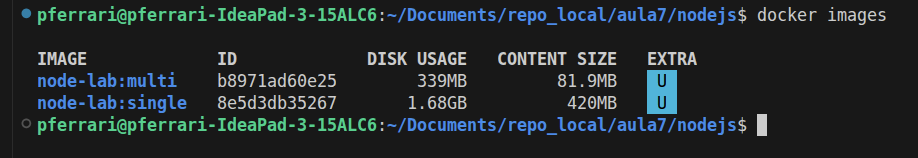

# Aula — Node.js com Docker Multi-Stage

Este laboratório mostra, na prática, como **containerizar uma aplicação Node.js** e comparar duas abordagens de build:

- **Single-stage build**
- **Multi-stage build**

A ideia é entender por que o **multi-stage** é uma prática importante para gerar imagens mais enxutas, organizadas e apropriadas para produção.

## Estrutura do projeto

```text
├── Dockerfile.multi
├── Dockerfile.single
├── package.json
├── README.md
├── src
│   └── server.ts
└── tsconfig.json
```

### Papel de cada arquivo

- **src/server.ts**: Aplicação Node.js/TypeScript do laboratório
- **package.json**: Dependências Node.js e scripts do projeto
- **tsconfig.json**: Configuração de compilação do TypeScript
- **Dockerfile.single**: Build em uma única etapa (Single Stage)
- **Dockerfile.multi**: Build em múltiplas etapas (Multi Stage)

## Sobre a aplicação

Este projeto é uma aplicação **Node.js + TypeScript**.

A aplicação expõe um endpoint HTTP simples em `/`, retornando um JSON com status de sucesso.

Exemplo de resposta esperada:

```json
{"message":"Lab Node.js com Docker Multi-Stage","status":"ok"}
```

A aplicação escuta na porta **3000**.

## Pré-requisitos

Antes de começar, garanta que você tenha:

- Docker instalado e funcionando;
- Node.js e npm instalados;
- Acesso ao terminal da sua máquina ou VM com permissão sudo (super user);
- Internet para baixar dependências e imagens base.

## Conceito rápido: Single-stage vs Multi-stage

### Single-stage
Tudo acontece em uma única imagem:
- Dependências de build;
- Código-fonte;
- Compilação;
- Execução.

É mais simples de entender no começo, mas normalmente gera imagens:
- Maiores;
- Menos limpas;
- Com arquivos desnecessários em runtime.

### Multi-stage
O build é dividido em etapas.

Exemplo conceitual:
- **stage 1 - BUILD:** Instala dependências e compila a aplicação;
- **stage 2 - RUNTIME:** Copia apenas o necessário para executar.

Com isso, a imagem final tende a ser:
- Menor;
- Mais organizada;
- Mais segura;
- Mais adequada para produção.

## 1) Executando localmente

Instale as dependências:

```bash
npm install
```

Compile o projeto TypeScript:

```bash
npm run build
```

Inicie a aplicação:

```bash
npm start
```

### Teste

Em outro terminal, execute:

```bash
curl http://localhost:3000
```

### Resultado esperado

Você deve receber um JSON semelhante a este:

```json
{"message":"Lab Node.js com Docker Multi-Stage","status":"ok"}
```

## 2) Build da imagem com Dockerfile Single-Stage

No **single-stage**, tudo acontece dentro da mesma imagem:

- Imagem base;
- Instalação de ferramentas de build;
- Instalação de dependências;
- Cópia da aplicação;
- Execução.

É simples de entender, mas normalmente gera uma imagem final com mais camadas e mais componentes do que o necessário.

```bash
docker build -f Dockerfile.single -t node-lab:single .
```

### Executar o container

```bash
docker run --rm -d --name node-single -p 3001:3000 node-lab:single
```

### Testar a aplicação

```bash
curl http://localhost:3001
```

## 3) Build da imagem com Dockerfile Multi-Stage

No **multi-stage**, o processo é separado em etapas.

### Ideia principal

- **Stage de build**: Instala ferramentas e dependências
- **Stage de runtime**: Recebe apenas o que é necessário para executar a aplicação

```bash
docker build -f Dockerfile.multi -t node-lab:multi .
```

Neste laboratório, a etapa do BUILD roda a instalação das dependências e o builda da aplicação `npm run buld` e depois copia a aplicação "Buildada" para a imagem final (Etapa do Runtime)

Isso permite que a imagem de runtime fique mais limpa, sem carregar ferramentas de compilação que foram necessárias apenas durante a construção.

### Executar o container

```bash
docker run --rm -d --name node-multi -p 3002:3000 node-lab:multi
```

### Testar a aplicação

```bash
curl http://localhost:3002
```

### O que observar?

Mesmo comportamento da aplicação, porém com uma imagem que tende a ser mais enxuta e mais apropriada para runtime.

## 4) Comparando as imagens

Use o comando abaixo para inspecionar o histórico de camadas da imagem single-stage:

```bash
docker history node-lab:single
```

Agora compare com a multi-stage:

```bash
docker history node-lab:multi
```

Use o comando abaixo para comprar o tamanho das imagens:

```bash
docker images
```

### O que analisar

Observe principalmente:

- Tamanho total das imagens;
- Quantidade de camadas (menos camadas na imagem multi stage);
- Organização da imagem final;
- Diferença de tamanho entre as imagens.



### Conceito importante

No laboratório, o ganho principal do multi-stage é **separar build de runtime**.

Em projetos maiores, isso ajuda a:

- Reduzir superfície de ataque;
- Evitar ferramentas desnecessárias em produção;
- Deixar a imagem mais previsível;
- Melhorar organização do Dockerfile.

## 5) Entendendo os Dockerfiles

### Dockerfile.single

No modelo single-stage:

- Usa uma imagem Node.js como base;
- Instala as dependências do projeto `package.json`;
- Copia o código da aplicação;
- Compila o TypeScript `npm run build`;
- Executa a aplicação com `node dist/server.js`.

### Dockerfile.multi

No modelo multi-stage:

- O **stage build** instala dependências e compila o projeto, o código TypeScript da pasta `src` é transformado em arquivos JavaScript na pasta `dist`;
- O **stage runtime** começa de uma nova imagem limpa;
- Apenas os arquivos necessários para execução são copiados para a imagem final, como a pasta `dist` e as dependências de runtime.

Ou seja: a imagem final fica focada em **executar**, e não em **construir**.

## 6) Parando os containers do laboratório

Se quiser parar os containers em execução:

```bash
docker stop $(docker ps -q)
```

Se quiser parar apenas os containers deste laboratório:

```bash
docker stop py-single py-multi
```

## 7) Fluxo resumido do laboratório

```bash
# Rodando local
npm install
npm run build
npm start

# Single-stage
docker build -f Dockerfile.single -t node-lab:single .
docker run --rm -d --name node-single -p 3001:3000 node-lab:single
curl http://localhost:3001

# Multi-stage
docker build -f Dockerfile.multi -t node-lab:multi .
docker run --rm -d --name node-multi -p 3002:3000 node-lab:multi
curl http://localhost:3002

# Comparação
docker history node-lab:single
docker history node-lab:multi
docker images

# Parada
docker stop node-single node-multi
```

## 8) O que você aprendeu com este lab

Este laboratório ajuda a consolidar conceitos importantes:

- Containerizar aplicações Node.js;
- Separar build de runtime;
- Reduzir tamanho de imagem;
- Evitar levar arquivos desnecessários para produção;
- Entender o valor do Docker multi-stage em cenários reais.

## 9) Troubleshooting

### A porta já está em uso

Erro comum:

```bash
Bind for 0.0.0.0:3001 failed: port is already allocated
```

**Solução:**
- Pare o container que está usando a porta; ou
- Troque a porta no `docker run`.

Exemplo:

```bash
docker run --rm -d --name node-single -p 3011:3000 node-lab:single
```

### O build TypeScript falhou

Verifique se as dependências foram instaladas corretamente:

```bash
npm install
npm run build
```

### O container sobe, mas o `curl` falha

Veja os logs do container:

```bash
docker logs node-single
docker logs node-multi
```

### O nome do container já existe

Remova o container antigo:

```bash
docker rm -f node-single
docker rm -f node-multi
```