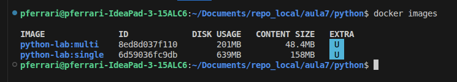

# Aula — Laboratório: Aplicação Python com Docker Multi-Stage

Este laboratório demonstra, na prática, como empacotar uma aplicação **Python + Flask** em container usando duas abordagens:

- **Single-stage build**
- **Multi-stage build**

A ideia é entender como o **multi-stage** é uma prática importante para gerar imagens mais enxutas, organizadas e apropriadas para produção

## Estrutura do projeto

```bash
.
├── .dockerignore
├── app.py
├── Dockerfile.multi
├── Dockerfile.single
├── README.md
└── requirements.txt
```

### Papel de cada arquivo

- **app.py**: Aplicação Flask do laboratório
- **requirements.txt**: Dependências Python do projeto
- **Dockerfile.single**: Build em uma única etapa (Single Stage)
- **Dockerfile.multi**: Build em múltiplas etapas (Multi Stage)
- **.dockerignore**: Evita enviar arquivos desnecessários para o contexto de build

## Sobre a aplicação

A aplicação expõe uma rota HTTP simples em `/` e retorna um JSON:

```json
{"message": "Lab Python com Docker Multi-Stage","status": "ok"}
```

A aplicação sobe na porta **5000**.

## Pré-requisitos

Antes de começar, tenha disponível:

- Python 3 instalado
- Docker instalado
- Acesso ao terminal da sua máquina ou VM com permissão sudo (super user);
- Internet para baixar imagem base e dependências

## Conceito rápido: Single-stage vs Multi-stage

### Single-stage
Tudo acontece em uma única imagem:
- Dependências de build;
- Código-fonte;
- Compilação;
- Execução.

É mais simples de entender no começo, mas normalmente gera imagens:
- Maiores;
- Menos limpas;
- Com arquivos desnecessários em runtime.

### Multi-stage
O build é dividido em etapas.

Exemplo conceitual:
- **stage 1 - BUILD:** Instala dependências e compila a aplicação;
- **stage 2 - RUNTIME:** Copia apenas o necessário para executar.

Com isso, a imagem final tende a ser:
- Menor;
- Mais organizada;
- Mais segura;
- Mais adequada para produção.

## 1) Executando localmente com Python

Primeiro, vamos validar a aplicação fora do Docker.

### Criar ambiente virtual

```bash
python3 -m venv .venv
```

### Ativar o ambiente virtual

```bash
source .venv/bin/activate
```

### Atualizar o pip

```bash
python -m pip install --upgrade pip
```

### Instalar dependências

```bash
python -m pip install -r requirements.txt
```

### Executar a aplicação

```bash
python app.py
```

### Testar a aplicação

Em outro terminal:

```bash
curl http://localhost:5000
```

### Resultado esperado

Você deve receber uma resposta parecida com esta:

```json
{"message":"Lab Python com Docker Multi-Stage","status":"ok"}
```

### Desativar o ambiente virtual

```bash
deactivate
```

## 2) Build da imagem com Dockerfile Single-Stage

No **single-stage**, tudo acontece dentro da mesma imagem:

- Imagem base;
- Instalação de ferramentas de build;
- Instalação de dependências;
- Cópia da aplicação;
- Execução.

É simples de entender, mas normalmente gera uma imagem final com mais camadas e mais componentes do que o necessário.

### Build da imagem

```bash
docker build -f Dockerfile.single -t python-lab:single .
```

### Executar o container

```bash
docker run --rm -d --name py-single -p 5001:5000 python-lab:single
```

### Testar a aplicação

```bash
curl http://localhost:5001
```

## 3) Build no modelo Multi-Stage

No **multi-stage**, o processo é separado em etapas.

### Ideia principal

- **Stage de build**: Instala ferramentas e dependências
- **Stage de runtime**: Recebe apenas o que é necessário para executar a aplicação

Neste laboratório, o build cria um **ambiente virtual em `/opt/venv`** e depois copia esse ambiente para a imagem final.

Isso permite que a imagem de runtime fique mais limpa, sem carregar ferramentas de compilação que foram necessárias apenas durante a construção.

### Build da imagem

```bash
docker build -f Dockerfile.multi -t python-lab:multi .
```

### Executar o container

```bash
docker run --rm -d --name py-multi -p 5002:5000 python-lab:multi
```

### Testar a aplicação

```bash
curl http://localhost:5002
```

### Resultado esperado

A aplicação deve responder normalmente, da mesma forma que no single-stage.

## 4) Comparando as imagens

Agora compare as camadas das duas imagens:

```bash
docker history python-lab:single
```

```bash
docker history python-lab:multi
```

Use o comando abaixo para comprar o tamanho das imagens:

```bash
docker images
```

### O que analisar

Observe principalmente:

- Tamanho total das imagens;
- Quantidade de camadas (menos camadas na imagem multi stage);
- Organização da imagem final;
- Diferença de tamanho entre as imagens.



### Conceito importante

No laboratório, o ganho principal do multi-stage é **separar build de runtime**.

Em projetos maiores, isso ajuda a:

- Reduzir superfície de ataque;
- Evitar ferramentas desnecessárias em produção;
- Deixar a imagem mais previsível;
- Melhorar organização do Dockerfile.

## 5) Entendendo os Dockerfiles

### Dockerfile.single

No modelo single-stage:

- Usa `python:3.12-slim` como base;
- Instala ferramentas como `build-essential` e `gcc`;
- Instala as dependências do `requirements.txt`;
- Copia `app.py`;
- Executa a aplicação com `python app.py`.

### Dockerfile.multi

No modelo multi-stage:

- O **stage build** instala ferramentas e dependências;
- É criado um **venv** em `/opt/venv`;
- O **stage runtime** começa de uma nova imagem limpa;
- Apenas o `venv` e o `app.py` são copiados para a imagem final.

Ou seja: a imagem final fica focada em **executar**, e não em **construir**.

## 6) Papel do `.dockerignore`

O arquivo `.dockerignore` ajuda a evitar que itens desnecessários entrem no contexto de build.

Neste laboratório, ele ignora arquivos como:

- `__pycache__/`
- `*.pyc`
- `.venv/`
- `.git`
- `README.md`


## 7) Parando os containers do laboratório

Se quiser parar os containers em execução:

```bash
docker stop $(docker ps -q)
```

Se quiser parar apenas os containers deste laboratório:

```bash
docker stop py-single py-multi
```

## 8) Fluxo resumido do laboratório

```bash
# Rodando local
python3 -m venv .venv
source .venv/bin/activate
python -m pip install --upgrade pip
python -m pip install -r requirements.txt
python app.py
curl http://localhost:5000

# Single-stage
docker build -f Dockerfile.single -t python-lab:single .
docker run --rm -d --name py-single -p 5001:5000 python-lab:single
curl http://localhost:5001

# Multi-stage
docker build -f Dockerfile.multi -t python-lab:multi .
docker run --rm -d --name py-multi -p 5002:5000 python-lab:multi
curl http://localhost:5002

# Comparação
docker history python-lab:single
docker history python-lab:multi
docker images

# Parada
docker stop py-single py-multi

# Sair do ambiente virtual
deactivate
```

## 9) Troubleshooting

### A porta 5001 ou 5002 já está em uso

Escolha outra porta no host:

```bash
docker run --rm -d --name py-single -p 8081:5000 python-lab:single
```

### O `curl` não respondeu

Verifique se o container está rodando:

```bash
docker ps
```

Verifique os logs:

```bash
docker logs py-single
```

ou

```bash
docker logs py-multi
```

### A imagem não builda corretamente

Confira:

- se o `Dockerfile.single` ou `Dockerfile.multi` está no diretório correto;
- se o `requirements.txt` existe;
- se o Docker está ativo no host.

### O Flask não sobe

Valide a execução local primeiro:

```bash
python3 -m venv .venv
source .venv/bin/activate
python -m pip install -r requirements.txt
python app.py
```

Se funcionar localmente, o próximo passo é revisar o build da imagem.

## 10) O que você aprendeu com este lab

Neste laboratório, você praticou:

- Execução local de uma aplicação Python;
- Build de imagem Docker em **single-stage**;
- Build de imagem Docker em **multi-stage**;
- Comparação entre as abordagens;
- Uso de `.dockerignore` para melhorar o build.

A principal lição é que o **multi-stage build** ajuda a separar responsabilidades dentro do Dockerfile, tornando a imagem final mais adequada para runtime.