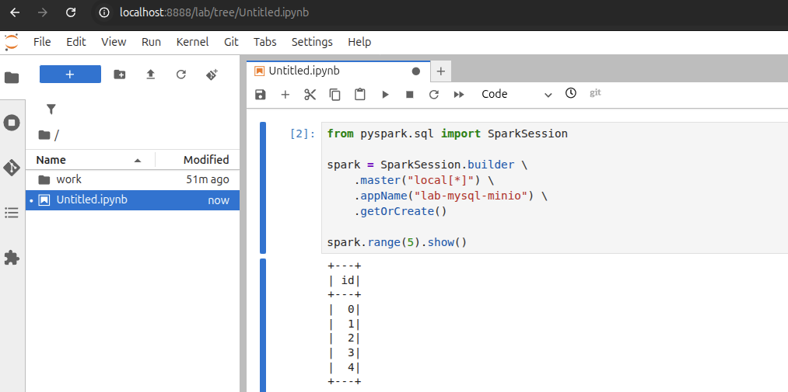
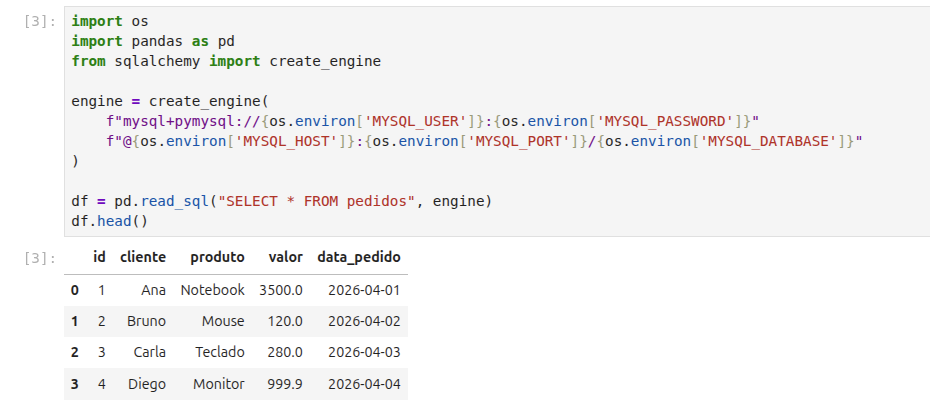
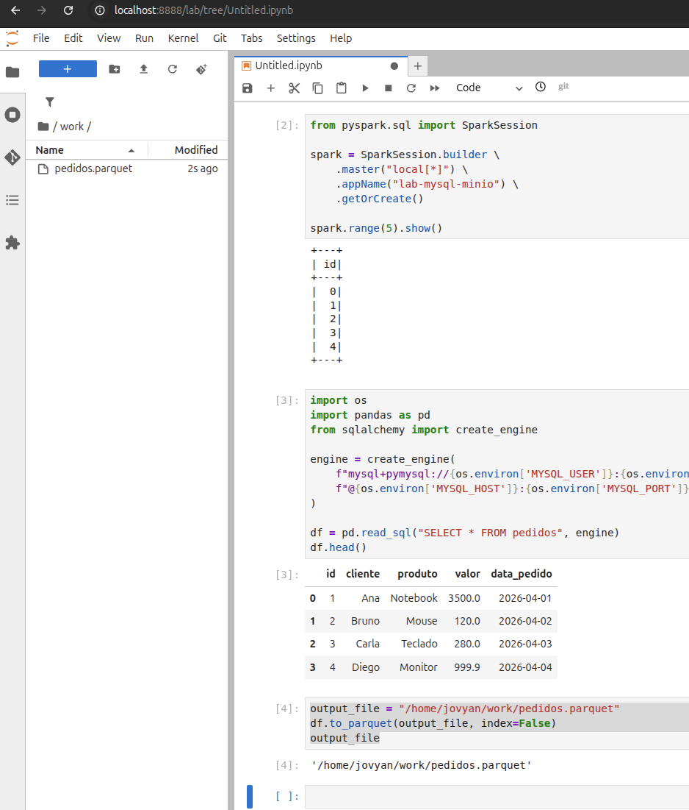
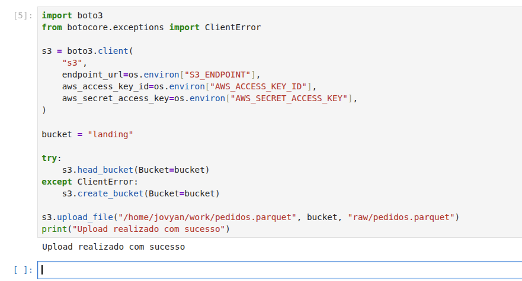
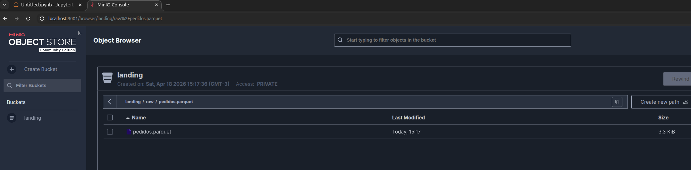
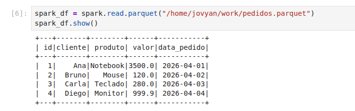
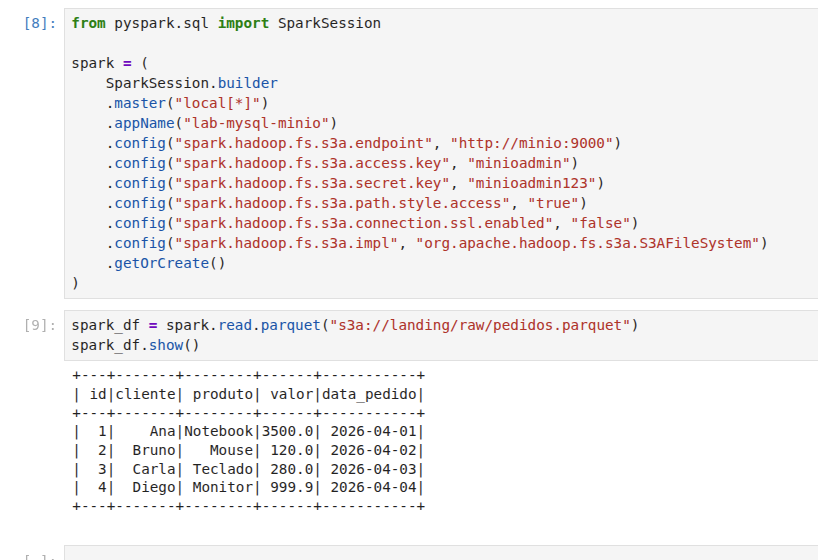

# Aula — Hands On: Stack de Aplicações de Dados com Docker Compose

Este laboratório mostra como subir uma **stack de dados local** usando **Docker Compose**, integrando:

- **MySQL** como banco de origem;
- **JupyterLab com PySpark** para exploração e processamento de dados;
- **MinIO** como armazenamento de objetos compatível com S3.

A proposta é simular um fluxo comum em ambientes de dados:

1. Ler dados do banco relacional;
2. Transformar ou exportar os dados;
3. Salvar em **Parquet**;
4. Publicar o arquivo em um bucket no **MinIO**;
5. Ler esse mesmo arquivo com **Spark**.

## 1) Objetivo do laboratório

Ao final deste lab, você será capaz de:

- Subir uma stack completa de dados com `docker compose`;
- Entender o papel de cada serviço da arquitetura;
- Acessar o **JupyterLab** para executar código Python e Spark;
- Ler dados do **MySQL** com `pandas` + `SQLAlchemy`;
- Gravar dados em **Parquet**;
- Enviar arquivos para o **MinIO** via API S3;
- Ler o mesmo arquivo com **PySpark**, localmente e via `s3a://`.

## 2) Arquitetura da stack

A stack sobe três serviços principais:

- **mysql-src**: Banco MySQL com dados de origem da aplicação;
- **minio**: Armazenamento de objetos compatível com S3;
- **notebook**: Ambiente JupyterLab com PySpark e bibliotecas auxiliares.

## 3) Estrutura do projeto

```text
.
├── compose.yaml
├── mysql
│   └── init
│       └── 01_seed.sql
├── notebook
│   └── Dockerfile
└── work
```

## 4) Papel de cada arquivo

- **compose.yaml**: Define os serviços da stack, rede, volumes, portas e dependências entre containers.
- **mysql/init/01_seed.sql**: Script de inicialização do banco, usado para criar estruturas e popular dados de exemplo.
- **notebook/Dockerfile**: Imagem customizada do JupyterLab com PySpark e bibliotecas necessárias para o laboratório.
- **work/**: Diretório compartilhado (bind mount) com o notebook para salvar arquivos gerados durante o lab, como o Parquet.

## 5) Entendendo a stack

### MySQL (`mysql-src`)

Esse serviço sobe um banco **MySQL 8.0** com:

- banco: `source_db`
- usuário: `demo`
- senha: `demo123`

Além disso:

- Usa volume persistente para manter os dados;
- Executa scripts em `./mysql/init` na inicialização;
- Possui **healthcheck**, garantindo que o banco esteja pronto antes do notebook depender (depends_on) dele.

### MinIO (`minio`)

Esse serviço funciona como um **S3 local**, útil para laboratórios e ambientes de desenvolvimento.

Credenciais do laboratório:

- usuário: `minioadmin`
- senha: `minioadmin123`

Portas publicadas:

- **9000**: API S3
- **9001**: Console Web do MinIO

### Notebook (`pyspark-notebook`)

Esse serviço sobe um ambiente **JupyterLab com PySpark**, já preparado para:

- Conectar no MySQL;
- Manipular dados com `pandas`;
- Enviar arquivos para o MinIO com `boto3`;
- Ler arquivos Parquet com Spark;
- Acessar buckets S3/MinIO usando `s3a://`.

O notebook também recebe variáveis de ambiente com os dados de conexão do MySQL e do MinIO.

## 6) O que o Dockerfile do notebook adiciona

A imagem do notebook parte de uma base pronta de **Jupyter + PySpark**, e adiciona:

- Bibliotecas Python como `pandas`, `sqlalchemy`, `pymysql`, `boto3`, `s3fs` e `pyarrow`;
- Utilitários básicos do sistema, como `curl`;
- JARs necessários para integração do Spark com S3/MinIO via `s3a`.

Na prática, isso prepara o ambiente para ler do banco, gravar Parquet e acessar o MinIO direto pelo Spark.

## 7) Pré-requisitos

Antes de começar, você precisa ter:

- Docker instalado;
- Docker Compose disponível (`docker compose`);
- Portas **8888**, **9000** e **9001** livres no seu Host/VM;
- Acesso ao terminal como super user (sudo su) para executar os comandos do laboratório.

## 8) Subindo a stack

### Subir com build

```bash
docker compose up -d --build
```

Esse comando:

- Constrói a imagem do notebook;
- Cria a rede da aplicação;
- Sobe os containers;
- Inicializa os volumes persistentes.

### Subir novamente sem rebuild

```bash
docker compose up -d
```

### Verificar status dos serviços

```bash
docker compose ps
```

### Acompanhar logs

```bash
docker compose logs -f
```

## 9) Acessando os serviços

Após a stack subir, acesse:

- **JupyterLab**: `http://localhost:8888/lab?token=lab123`
- **MinIO Console**: `http://localhost:9001`
- **MinIO API**: `http://localhost:9000`

## 10) Criando uma sessão Spark

No JupyterLab, crie uma sessão Spark com o código abaixo:

```python
from pyspark.sql import SparkSession

spark = SparkSession.builder \
    .master("local[*]") \
    .appName("lab-mysql-minio") \
    .getOrCreate()

spark.range(5).show()
```

Se funcionar, o Spark está operacional no container do notebook.



## 11) Lendo dados do MySQL

Agora leia a tabela do banco usando `pandas` + `SQLAlchemy`:

```python
import os
import pandas as pd
from sqlalchemy import create_engine

engine = create_engine(
    f"mysql+pymysql://{os.environ['MYSQL_USER']}:{os.environ['MYSQL_PASSWORD']}"
    f"@{os.environ['MYSQL_HOST']}:{os.environ['MYSQL_PORT']}/{os.environ['MYSQL_DATABASE']}"
)

df = pd.read_sql("SELECT * FROM pedidos", engine)
df.head()
```
Aqui, o notebook usa as variáveis de ambiente configuradas no `compose.yaml` para se conectar ao MySQL.



## 12) Salvando os dados em Parquet

Depois de ler os dados do banco, salve localmente em formato Parquet:

```python
output_file = "/home/jovyan/work/pedidos.parquet"
df.to_parquet(output_file, index=False)
output_file
```

Esse arquivo será salvo dentro da pasta compartilhada `work/`.



## 13) Criando bucket e enviando para o MinIO

Agora envie o arquivo para o MinIO:

```python
import boto3
from botocore.exceptions import ClientError

s3 = boto3.client(
    "s3",
    endpoint_url=os.environ["S3_ENDPOINT"],
    aws_access_key_id=os.environ["AWS_ACCESS_KEY_ID"],
    aws_secret_access_key=os.environ["AWS_SECRET_ACCESS_KEY"],
)

bucket = "landing"

try:
    s3.head_bucket(Bucket=bucket)
except ClientError:
    s3.create_bucket(Bucket=bucket)

s3.upload_file("/home/jovyan/work/pedidos.parquet", bucket, "raw/pedidos.parquet")
print("Upload realizado com sucesso")
```



Ao final, o arquivo estará disponível no bucket `landing`, no caminho:

```text
raw/pedidos.parquet
```



## 14) Lendo o Parquet local com Spark

Antes de ler do MinIO, você pode validar o arquivo local:

```python
spark_df = spark.read.parquet("/home/jovyan/work/pedidos.parquet")
spark_df.show()
```



## 15) Lendo o Parquet do MinIO com Spark

Agora recrie a sessão Spark com as configurações de acesso ao MinIO via `s3a`:

```python
try:
    spark.stop()
except:
    pass
```

```python
from pyspark.sql import SparkSession

spark = (
    SparkSession.builder
    .master("local[*]")
    .appName("lab-mysql-minio")
    .config("spark.hadoop.fs.s3a.endpoint", "http://minio:9000")
    .config("spark.hadoop.fs.s3a.access.key", "minioadmin")
    .config("spark.hadoop.fs.s3a.secret.key", "minioadmin123")
    .config("spark.hadoop.fs.s3a.path.style.access", "true")
    .config("spark.hadoop.fs.s3a.connection.ssl.enabled", "false")
    .config("spark.hadoop.fs.s3a.impl", "org.apache.hadoop.fs.s3a.S3AFileSystem")
    .getOrCreate()
)
```

```python
spark_df = spark.read.parquet("s3a://landing/raw/pedidos.parquet")
spark_df.show()
```

Essa etapa comprova que o Spark consegue consumir dados armazenados em um bucket compatível com S3.



## 16) Resultados esperados

Ao final do laboratório, você deve conseguir:

- Acessar o JupyterLab no navegador;
- Acessar o console do MinIO;
- Consultar a tabela `pedidos` no MySQL;
- Gerar o arquivo `pedidos.parquet`;
- Enviar o arquivo para o bucket `landing`;
- Ler o arquivo com Spark localmente;
- Ler o mesmo arquivo com Spark via `s3a://`.

## 17) Troubleshooting básico

### O JupyterLab não abre

Verifique se o container do notebook está em execução:

```bash
docker compose ps
```

Veja os logs:

```bash
docker compose logs -f notebook
```

### O notebook não conecta no MySQL

Confirme se o banco está saudável:

```bash
docker compose ps
```

Veja os logs do MySQL:

```bash
docker compose logs -f mysql-src
```

### O upload para o MinIO falha

Verifique se o MinIO está acessível:

- API: `http://localhost:9000`
- Console: `http://localhost:9001`

Veja os logs:

```bash
docker compose logs -f minio
```

### O Spark não consegue ler `s3a://`

Normalmente esse problema está relacionado a:

- JARs ausentes;
- Endpoint incorreto;
- Credenciais erradas;
- Configuração incorreta de `path.style.access`.

Nesse laboratório, essas dependências já são adicionadas no `Dockerfile` do notebook.

## 18) Encerrando o ambiente

Para parar os containers:

```bash
docker compose stop
```

Para remover a stack:

```bash
docker compose down
```

Se quiser remover também os volumes, faça isso com cuidado:

```bash
docker compose down -v
```

## 19) Conclusão

Este laboratório demonstra, de forma prática, como montar uma pequena **plataforma de dados local** com Docker Compose.

Ele é útil para entender conceitos muito usados no mundo real, como:

- Integração entre banco relacional e processamento de dados;
- Armazenamento em formato colunar (Parquet);
- Uso de object storage compatível com S3;
- Leitura distribuída com Spark;
- Isolamento e portabilidade com containers.

---

### Observação: Explicação do compose.yaml, está dento do próprio arquivo em comentários (#)