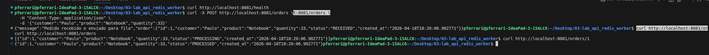
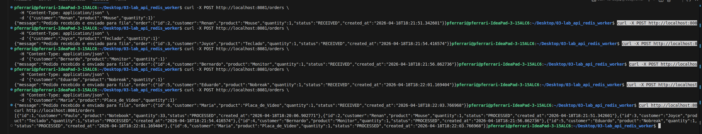
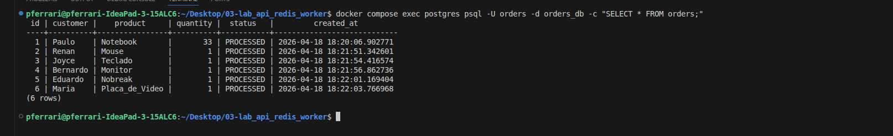
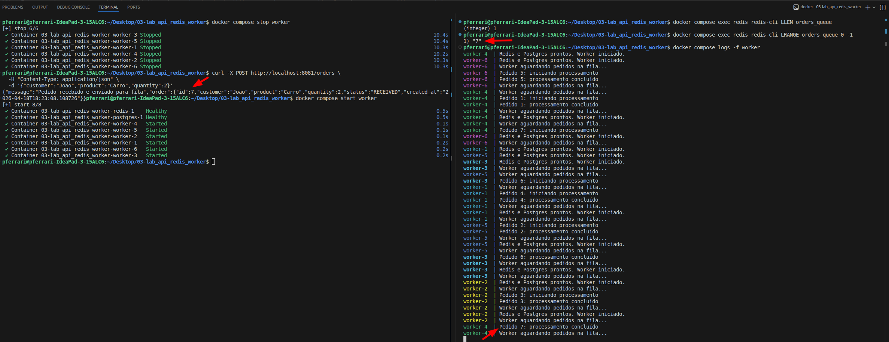
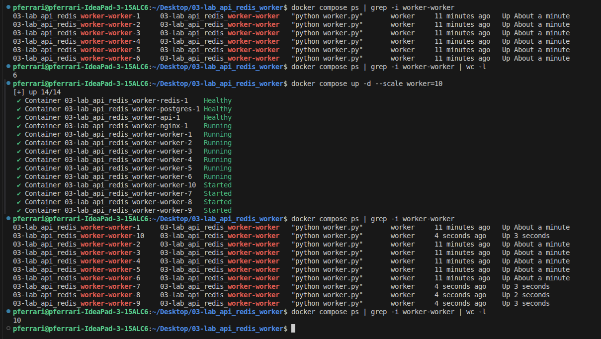

# Lab Docker Compose — API + Redis + Worker + Postgres + Nginx

Este laboratório demonstra como subir uma **stack com múltiplos containers** usando **Docker Compose**, separando responsabilidades entre **API**, **fila**, **worker**, **banco de dados** e **proxy reverso**.

A proposta é mostrar, de forma prática, um cenário comum em aplicações distribuídas:

- A **API** recebe requisições HTTP;
- Os pedidos são colocados em uma **fila no Redis**;
- O **worker** consome essa fila e processa os dados;
- O **Postgres** armazena os pedidos;
- O **Nginx** publica a aplicação para acesso externo.

## 1) Objetivo do laboratório

Ao final deste lab, você deverá conseguir:

- Subir uma aplicação com vários serviços via `docker compose`;
- Entender a função de cada container na arquitetura;
- Testar o fluxo de criação e consulta de pedidos;
- Validar o uso de **fila assíncrona** com Redis;
- Observar o papel do **Nginx como proxy reverso**;
- Entender como o Docker Compose fornece **rede interna e DNS por nome de serviço**.

## 2) Estrutura do projeto

```text
.
├── api
│   ├── app.py
│   ├── Dockerfile
│   └── requirements.txt
├── compose.yaml
├── nginx
│   ├── default.conf
│   └── Dockerfile
├── postgres
│   └── init.sql
└── worker
    ├── Dockerfile
    ├── requirements.txt
    └── worker.py
```

## 3) Arquitetura da stack

A stack sobe os seguintes serviços:

- **postgres**: banco de dados relacional da aplicação;
- **redis**: fila de mensagens usada para enfileirar pedidos;
- **api**: serviço HTTP que recebe e consulta pedidos;
- **worker**: processo consumidor da fila, responsável pelo processamento assíncrono;
- **nginx**: proxy reverso que expõe a aplicação na porta `8081`.

No `compose.yaml`, a stack foi organizada com duas redes:

- **front-net**: usada para a comunicação entre **nginx** e **api**;
- **back-net**: usada para a comunicação entre **api**, **worker**, **postgres** e **redis**.

Também há volumes persistentes para:

- **Postgres**: `pedidos-pgdata`;
- **Redis**: `pedidos-redisdata`.

## 4) Papel de cada parte

- **api/app.py**: Aplicação principal da API de pedidos;
- **api/Dockerfile**: Imagem da API;
- **api/requirements.txt**: Dependências Python da API;
- **worker/worker.py**: Consumidor da fila de pedidos;
- **worker/Dockerfile**: Imagem do worker;
- **worker/requirements.txt**: Dependências Python do worker;
- **postgres/init.sql**: Script inicial do banco de dados;
- **nginx/default.conf**: Configuração do proxy reverso;
- **nginx/Dockerfile**: Imagem do Nginx;
- **compose.yaml**: Orquestra toda a stack com redes, volumes, dependências e healthchecks;

## 5) Entendendo o `default.conf` do Nginx

O arquivo `nginx/default.conf` possui este trecho:

```nginx
upstream pedidos_api {
    server api:8000;
}
```

### O que isso significa na prática?

O Nginx **não aponta para o IP do container**.
Ele aponta para **`api`**, que é o **nome do serviço definido no `compose.yaml`**.

No Docker Compose, cada serviço entra na rede interna com um **nome DNS interno**. Isso quer dizer que:

- `api` resolve para o container da API;
- `postgres` resolve para o banco;
- `redis` resolve para o Redis.

Ou seja, **o Docker já faz a resolução por nome** dentro da rede.
Por isso, em `server`, o correto é usar o **nome do serviço**, e **não o IP do container**, já que o IP pode mudar quando o container é recriado.

### Regra importante

Em ambientes com Docker Compose:

- Use **nome do serviço** para comunicação entre containers;
- Evite configurar IP fixo manualmente sem necessidade.

## 6) Pré-requisitos

- Docker instalado
- Docker Compose disponível (`docker compose`)
- Acesso ao terminal como super user (sudo su) para executar os comandos do laboratório.

## 7) Subindo a stack

### Build inicial

```bash
docker compose up -d --build
```

Esse comando:

- Cria as imagens locais da **API**, do **worker** e do **Nginx**;
- Cria redes e volumes;
- Sobe os serviços em background.

### Subidas seguintes

```bash
docker compose up -d
```

### Verificar status

```bash
docker compose ps
```

### Ver logs

```bash
docker compose logs -f
```

## 8) Acessando a aplicação

O Nginx publica a stack em:

```text
http://localhost:8081
```

No `compose.yaml`, a porta publicada é `8081:80`.

## 9) Testando o fluxo da API

### 1. Healthcheck da aplicação

```bash
curl http://localhost:8081/health
```

### 2. Criar um pedido

```bash
curl -X POST http://localhost:8081/orders \
  -H "Content-Type: application/json" \
  -d '{"customer":"Paulo","product":"Notebook","quantity":33}'
```

### 3. Listar pedidos

```bash
curl http://localhost:8081/orders
```

### 4. Buscar um pedido específico

```bash
curl http://localhost:8081/orders/1
```





## 10) Validando o banco de dados

Você pode consultar os registros diretamente no Postgres com:

```bash
docker compose exec postgres psql -U orders -d orders_db -c "SELECT * FROM orders;"
```

Esse comando ajuda a confirmar se os dados processados chegaram ao banco.



## 11) Validando a fila no Redis

Uma parte importante deste lab é mostrar que o processamento pode ser **assíncrono**.

### Parar temporariamente o worker

```bash
docker compose stop worker
```

### Criar um novo pedido

```bash
curl -X POST http://localhost:8081/orders \
  -H "Content-Type: application/json" \
  -d '{"customer":"Joao","product":"Carro","quantity":2}'
```

### Ver o tamanho da fila

```bash
docker compose exec redis redis-cli LLEN orders_queue
```

### Ver o conteúdo da fila

```bash
docker compose exec redis redis-cli LRANGE orders_queue 0 -1
```

Se o worker estiver parado, o pedido deverá permanecer na fila.

### Subir novamente o worker

```bash
docker compose start worker
```

### Acompanhar o processamento

```bash
docker compose logs -f worker
```



## 12) Escalando o worker

Para simular maior capacidade de consumo da fila, você pode escalar o número de workers:

```bash
docker compose up -d --scale worker=10
```

Esse comando aumenta a quantidade de réplicas do serviço `worker`, útil para mostrar como a aplicação pode processar a fila em paralelo.



## 13) Healthchecks e dependências

No `compose.yaml`, a stack utiliza `healthcheck` e `depends_on` com condição de saúde.

Isso ajuda a garantir que:

- A **API** só suba depois que **Postgres** e **Redis** estiverem saudáveis;
- O **Nginx** só suba depois que a **API** estiver pronta;
- O ambiente fique mais estável durante a inicialização.

Esse é um ponto importante em stacks reais: **não basta o container estar iniciado; o serviço precisa estar pronto para uso**.

## 14) Fluxo resumido do laboratório

```bash
# Subir a stack
 docker compose up -d --build
 docker compose up -d

# Verificar status e logs
 docker compose ps
 docker compose logs -f

# Testar API
 curl http://localhost:8081/health

 curl -X POST http://localhost:8081/orders \
   -H "Content-Type: application/json" \
   -d '{"customer":"Paulo","product":"Notebook","quantity":33}'

 curl http://localhost:8081/orders
 curl http://localhost:8081/orders/1

# Validar banco
 docker compose exec postgres psql -U orders -d orders_db -c "SELECT * FROM orders;"

# Testar fila
 docker compose stop worker

 curl -X POST http://localhost:8081/orders \
   -H "Content-Type: application/json" \
   -d '{"customer":"Maria","product":"Mouse","quantity":2}'

 docker compose exec redis redis-cli LLEN orders_queue
 docker compose exec redis redis-cli LRANGE orders_queue 0 -1

 docker compose start worker
 docker compose logs -f worker

# Escalar worker
 docker compose up -d --scale worker=10

# Parar stack
 docker compose stop
 docker compose start
 docker compose down
```

## 15) Troubleshooting básico

### A aplicação não responde em `localhost:8081`

Verifique:

```bash
docker compose ps
docker compose logs -f nginx
docker compose logs -f api
```

### O worker não processa pedidos

Verifique:

```bash
docker compose logs -f worker
docker compose logs -f redis
```

Cheque também se a fila está acumulando itens:

```bash
docker compose exec redis redis-cli LLEN orders_queue
```

### A API não conecta no Postgres

Verifique os logs:

```bash
docker compose logs -f postgres
docker compose logs -f api
```

Confirme também as variáveis de ambiente no `compose.yaml`, como:

- `POSTGRES_HOST=postgres`
- `POSTGRES_PORT=5432`
- `POSTGRES_DB=orders_db`
- `POSTGRES_USER=orders`
- `POSTGRES_PASSWORD=orders123`

### O Nginx não encontra a API

Lembre-se:

- O `proxy_pass` deve usar o **nome do serviço**;
- Neste lab, o Nginx encaminha para `api:8000` via upstream `pedidos_api`.

Se o nome estiver errado no `default.conf`, a comunicação entre os containers falhará.

## 16) O que este laboratório ensina

Com este lab, você aprende na pratica conceitos muito comuns no mundo real:

- Separação de serviços por responsabilidade;
- Comunicação entre containers por **nome de serviço**;
- Uso de **proxy reverso** com Nginx;
- Uso de **fila assíncrona** com Redis;
- Persistência com Postgres;
- Healthchecks e inicialização ordenada;
- Escalabilidade horizontal do worker.

## 17) Encerrando o ambiente

### Parar os containers

```bash
docker compose stop
```

### Iniciar novamente

```bash
docker compose start
```

### Remover a stack

```bash
docker compose down -v
```

## 18) Conclusão

Este laboratório é um ótimo exemplo de aplicação distribuída simples com Docker Compose.

Ele mostra que, mesmo em ambiente local, já é possível trabalhar conceitos importantes de arquitetura moderna, como:

- API desacoplada do processamento;
- Fila para absorver carga;
- Banco persistente;
- Proxy reverso na borda;
- Rede interna com DNS automático do Docker.

---

### Observação: Explicação do compose.yaml, está dento do próprio arquivo em comentários (#)